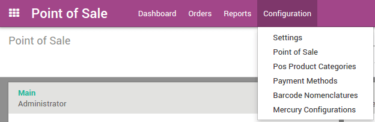
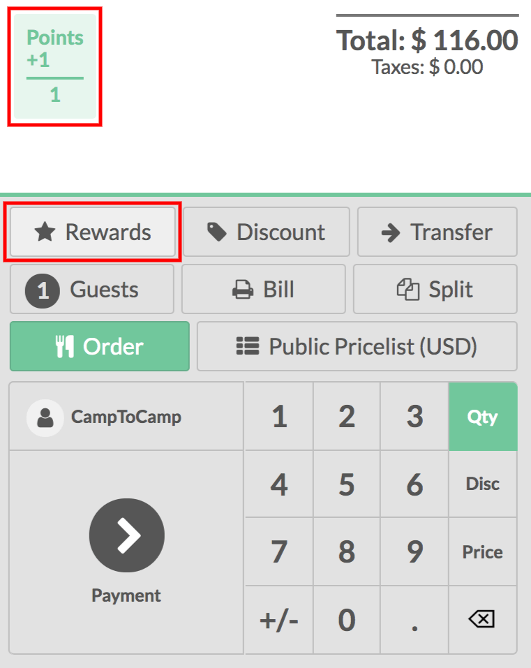
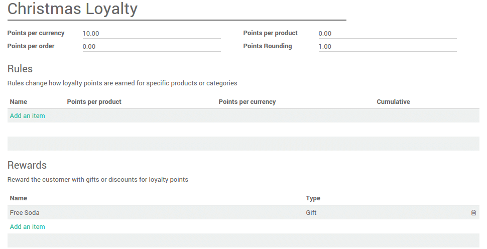
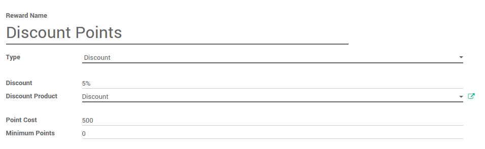
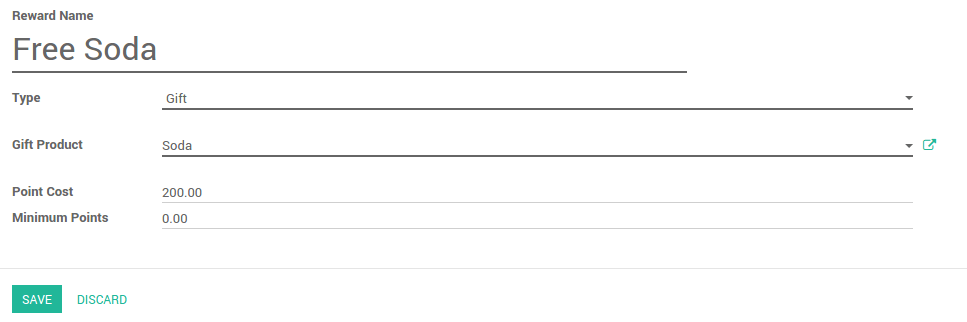
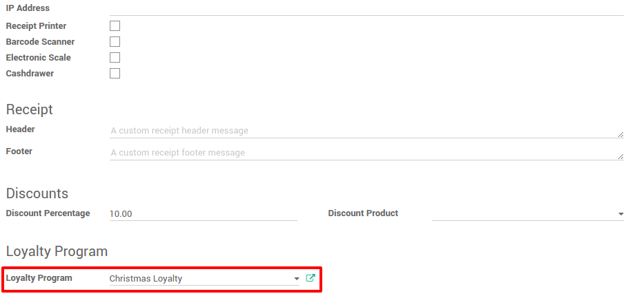

=============================================
How to create & run a loyalty & reward system
=============================================

Configuration
=============

In the **Point of Sale** application, go to 
:menuselection:`Configuration --> Settings`.

You can tick **Manage loyalty program with point and reward for
customers**.

.. image:: media/loyalty02.png
    :align: center

Create a loyalty program
========================

After you apply, go to :menuselection:`Configuration --> Loyalty Programs`
and click on **Create**.

Set a **name** and an **amount** of points given **by currency**, 
**by order** or **by product**. Extra rules can also be added 
such as **extra points** on a product.

To do this click on **Add an item** under **Rules**.

You can configure any rule by setting some configuration values.

-   **Name**: An internal identification for this loyalty program rule
-   **Type**: Does this rule affects products, or a category of products?
-   **Target Product**: The product affected by the rule
-   **Target Category**: The category affected by the rule
-   **Cumulative**: The points won from this rule will be won in addition to other rules
-   **Points per product**: How many points the product will earn per product ordered
-   **Points per currency**: How many points the product will earn per value sold

.. image:: media/loyalty05.png
    :align: center

Your new rule is now created and rewards can be added by clicking on
**Add an Item** under **Rewards**.

.. image:: media/loyalty06.png
    :align: center

Three types of reward can be given: 

-   **Resale**: convert your points into money. Set a product that represents the value of 1 point.

.. image:: media/loyalty14.png
    :align: center

-   **Discount**: give a discount for an amount of points. Set a product with a price of ``0 €`` and without any taxes.

-   **Gift**: give a gift for an amount of points

Applying your loyalty program to a point of sale
================================================

On the **Dashboard**, click on :menuselection:`More --> Settings`.

.. image:: media/loyalty08.png
    :align: center

Next to loyalty program, set the program you want to set.

Gathering and consuming points
==============================

To start gathering points you need to set a customer on the order.

Click on **Customer** and select the right one.

Loyalty points will appear on screen.

.. image:: media/loyalty10.png
    :align: center

The next time the customer comes to your shop and has enough points to
get a reward, the **Rewards** button is highlighted and gifts can be
given.

.. image:: media/loyalty11.png
    :align: center

The reward is added and of course points are subtracted from the total.

.. image:: media/loyalty12.png
    :align: center

.. seealso::
    * :doc:`../shop/cash_control`
    * :doc:`../shop/invoice`
    * :doc:`../shop/refund`
    * :doc:`../shop/seasonal_discount`