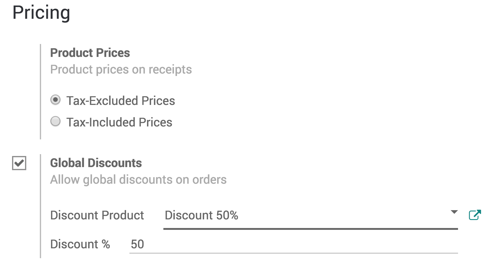
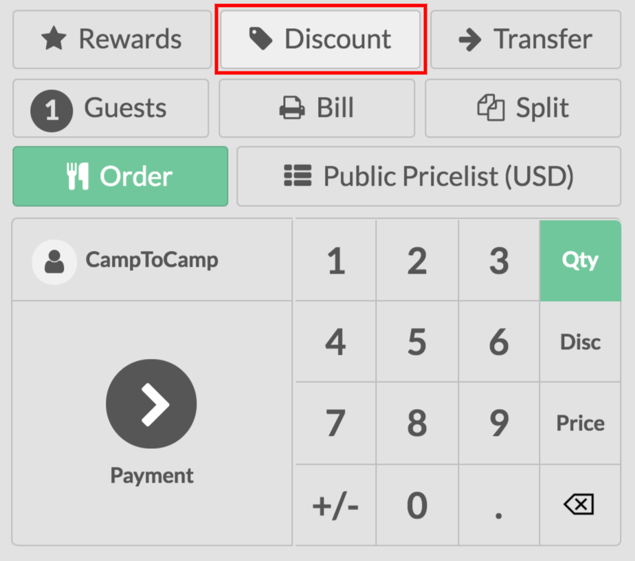
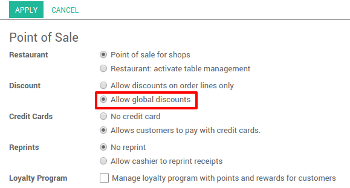

======================
Apply manual discounts
======================

If you seldom use discounts, applying manual discounts might be the
easiest solution for your Point of Sale.

You can either apply a discount on the whole order or on specific
products.

Apply a discount on a product
=============================

From your session interface, use *Disc* button.

.. image:: media/manual_discount01.png
    :align: center

You can then input a discount (in percentage) over the product that is
currently selected and the discount will be applied.

Apply a global discount
=======================

To apply a discount on the whole order, go to :menuselection:`Point of
Sales --> Configuration --> Point of sale` and select your PoS interface.

Under the *Pricing* category, you will find *Global Discounts*
select it.

You now have a new *Discount* button in your PoS interface.

Once clicked you can then enter your desired discount (in percentages).

On this example, you can see a global discount of 50% as well as a
specific product discount also at 50%.
