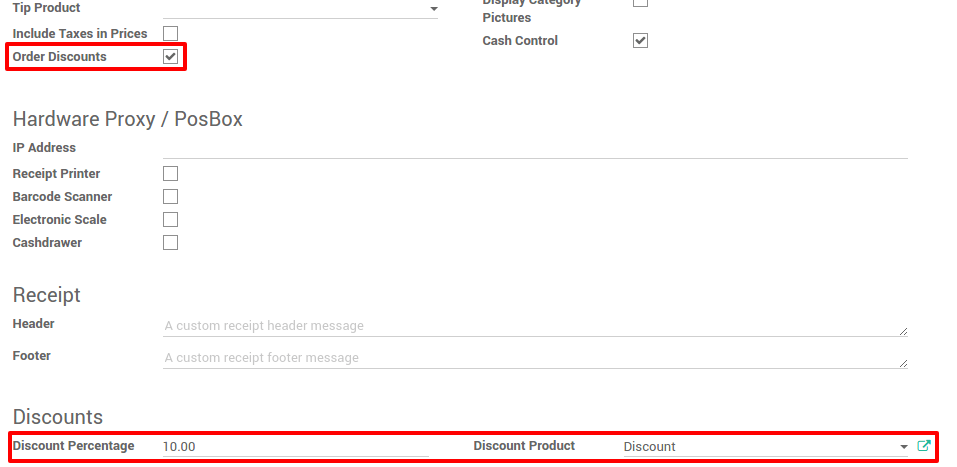
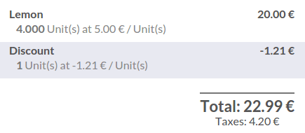

==============================
How to apply manual discounts?
==============================

Overview
========

You can apply manual discounts in two different ways. You can directly
set a discount on the product or you can set a global discount on the
whole cart.

Discount on the product
=======================

On the dashboard, click on **New Session**:

.. image:: media/manual_discount01.png
    :align: center

You will get into the main point of sale interface :

.. image:: media/manual_discount02.png
    :align: center

On the right you can see the list of your products with the categories
on the top. If you click on a product, it will be added in the cart. You
can directly set the correct quantity or weight by typing it on the
keyboard.

The same way you insert a quantity, Click on **Disc** and then type the
discount (in percent). This is how you insert a manual discount on a
specific product.

.. image:: media/manual_discount03.png
    :align: center

Global discount
===============

Configuration
-------------

If you want to set a global discount, you need to go to 
:menuselection:`Configuration --> Settings` and 
tick **Allow global discounts**

Then from the dashboard, click on :menuselection:`More --> Settings`

.. image:: media/manual_discount05.png
    :align: center

You have to activate **Order Discounts** and create a product that will be
added as a product with a negative price to deduct the discount.

On the product used to create the discount, set the price to ``0`` and do
not forget to remove all the **taxes**, that can make the calculation wrong.

.. image:: media/manual_discount07.png
    :align: center

Set a global discount
---------------------

Now when you come back to the **dashboard** and start a **new session**, a
**Discount** button appears and by clicking on it you can set a **discount**.

.. image:: media/manual_discount08.png
    :align: center

When it's validated, the discount line appears on the order and you can
now process to the payment.

.. seealso::
    * :doc:`../shop/cash_control`
    * :doc:`../shop/invoice`
    * :doc:`../shop/refund`
    * :doc:`../shop/seasonal_discount`
