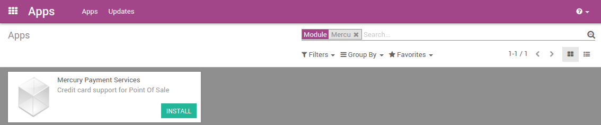

========================================
Accept credit card payment using Mercury
========================================

A MercuryPay account (see `*MercuryPay
website* <https://www.mercurypay.com/>`__) is required to accept credit
card payments in Odoo 11 PoS with an integrated card reader. MercuryPay
only operates with US and Canadian banks making this procedure only
suitable for North American businesses.

An alternative to an integrated card reader is to work with a standalone
card reader, copy the transaction total from the Odoo POS screen into
the card reader, and record the transaction in Odoo POS.

Install Mercury
===============

To install Mercury go to :menuselection:`Apps` and search for the
*Mercury* module.

Configuration
=============

To configure mercury, you need to activate the developer mode. To do so
go to :menuselection:`Apps --> Settings` and select *Activate the
developer mode*.

.. image:: media/mercury02.png
    :align: center

While in developer mode, go to :menuselection:`Point of Sale -->
Configuration --> Mercury Configurations`.

Create a new configuration for credit cards and enter your Mercury
credentials.

Then go to :menuselection:`Point of Sale --> Configuration --> Payment
Methods` and create a new one.

Under *Point of Sale* when you select *Use in Point of Sale* you can
then select your Mercury credentials that you just created.

.. image:: media/mercury04.png
    :align: center

You now have a new option to pay by credit card when validating a
payment.
