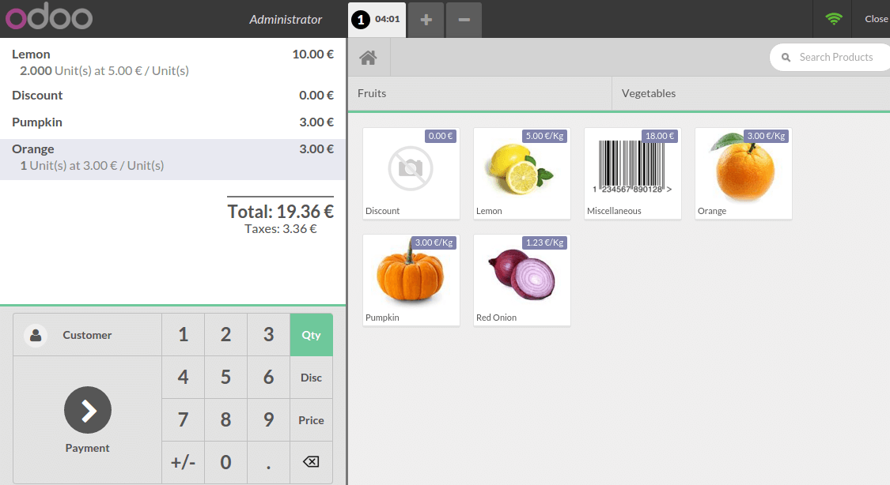
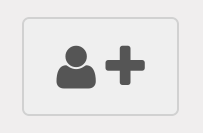
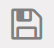
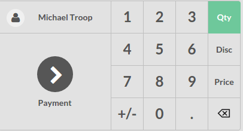

==========================
How to register customers?
==========================

Register an order
=================

On the dashboard, click on **New Session**:

.. image:: media/register01.png
    :align: center

You arrive now on the main view :

On the right you can see the list of your products with the categories
on the top. If you click on a product, it will be added in the cart. You
can directly set the quantity or weight by typing it on the keyboard.

Record a customer
=================

On the main view, click on **Customer**:

Register a new customer by clicking on the button.

The following form appear. Fill in the relevant information:

.. image:: media/register05.png
    :align: center

When it's done click on the **floppy disk** icon 

You just registered a new customer. To set this customer to the current
order, just tap on **Set Customer**.

.. image:: media/register07.png
    :align: center

The customer is now set on the order.

.. seealso::
    * :doc:`../shop/cash_control`
    * :doc:`../shop/invoice`
    * :doc:`../shop/refund`
    * :doc:`../shop/seasonal_discount`