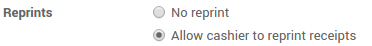
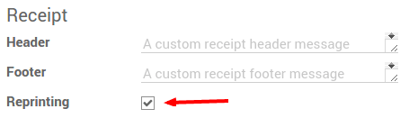
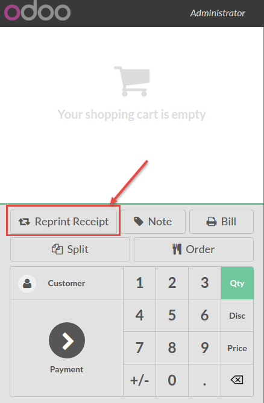

================
Reprint Receipts
================

Use the *Reprint receipt* feature if you have the need to reprint a ticket.

Configuration
=============

To activate *Reprint Receipt*, go to :menuselection:`Point of Sale
--> Configuration --> Point of sale`. and select your PoS interface.

Under the Bills & Receipts category, you will find *Reprint Receipt*
option.

.. note::
    In order to allow the option reprint receipt, you need to activate the receipt printer.

Reprint a receipt
=================

On your PoS interface, you now have a *Reprint receipt* button.

When you use it, you can then reprint your last receipt.

