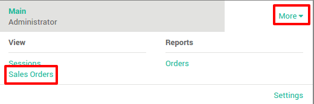

========================
How to reprint receipts?
========================

Configuration
=============

If you want to allow a cashier to reprint a ticket, go to
:menuselection:`Configuration --> Settings` and tick the option 
**Allow cashier to reprint receipts**.

You also need to allow the reprinting on the point of sale. Go to
:menuselection:`Configuration --> Point of Sale`, 
open the one you want to configure and and tick the option **Reprinting**.

How to reprint a receipt?
=========================

On the **Dashboard**, click on **More** and then on **Sales Orders**.

On the orders list, search and click on the order you want to reprint.

On the order, click on reprint.

.. seealso::
    * :doc:`../shop/cash_control`
    * :doc:`../shop/invoice`
    * :doc:`../shop/refund`
    * :doc:`../shop/seasonal_discount`