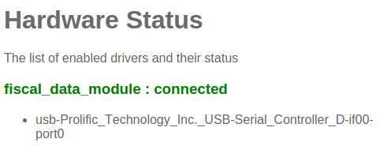

===================================================
Setting up the Fiscal Data Module with the Odoo POS
===================================================

Introduction
============

The Belgian government requires certain businesses to use a
government-certified device called a **Fiscal Data Module** (also
known as a **blackbox**). This device works together with the POS
application and logs certain transactions. On top of that, the used
POS application must also be certified by the government and must
adhere to strict standards specified by them. `Odoo 9 is a certified
application
<http://www.systemedecaisseenregistreuse.be/systemes-certifies>`_. More
information concerning the Fiscal Data Module can be found on `the
official website <http://www.systemedecaisseenregistreuse.be/>`_.

**As of December 2015, due to Belgian government restriction, the
certification is only valid for Odoo Online instances.**

Required hardware
=================

* A government certified `Fiscal Data Module
  <http://www.systemedecaisseenregistreuse.be/systemes-certifies#FDM%20certifiés>`_
  per POS, all of them should work, but the Cleancash SC-B is
  recommended, you will also need:

  * Serial null modem cable per FDM (`example
    <http://www.startech.com/Cables/Serial-Parallel-PS-2/DB9-DB25/10-ft-Cross-Wired-Serial-Null-Modem-Cable-DB9-FM~SCNM9FM>`__)
  * Serial-to-USB adapter per FDM (`example
    <http://trendnet.com/products/proddetail.asp?prod=265_TU-S9>`__)

* A POSBox per POS

Setup
=====

POSBox
------

In order to setup the blackbox, you will first have to ensure that the
POSBoxes you're using have a recent image on them (support for the FDM
was added to the POSBox image on the 10th of December 2015). See
:doc:`../overview/setup` on how to upgrade the POSBox. You can verify
that the Fiscal Data Module is recognized by the POSBox by going to
the *Hardware status page* via the POSBox homepage.

Odoo
----

An Odoo POS is turned into a certified POS by installing the **Belgian
Registered Cash Register** app (technical name:
``pos_blackbox_be``). Because of government restrictions imposed on
us, this installation cannot be undone. After this, you will have to
ensure that each POS configuration has a unique POSBox associated with
it (:menuselection:`Point of Sale --> Configuration --> Point of Sale`
and ensure Hardware Proxy / POSBox is set). The first time you open
the Point of Sale and attempt to do a transaction, you will be asked
to input the PIN that you received with your VAT signing card.

.. image:: media/vat_signing_card_pin.png
    :align: center

Restrictions
============

As mentioned before, in order to get certified the POS application
must adhere to strict government guidelines. Because of this, a
certified Odoo POS has some limitations not present in the
non-certified Odoo POS.

* Refunding is disabled
* Modifying orderline prices
* Creating/modifying/deleting POS orders
* Selling products without a valid tax
* Multiple Odoo POS configurations per POSBox are not allowed
* Using the POS without a connection to the POSBox (and thus FDM)
* Blacklisted modules: pos_discount, pos_reprint, pos_loyalty
