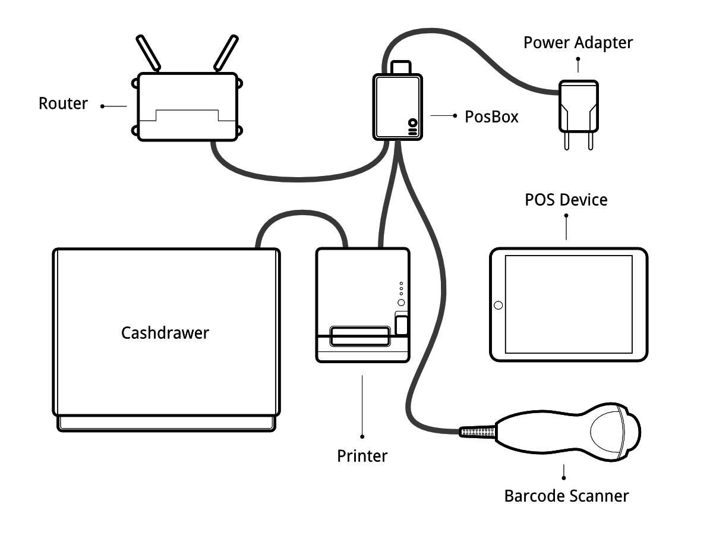

=./odoo.py --load=web,hw_proxy,hw_posbox_homepage,hw_posbox_upgrade,hw_scale,hw_scanner,hw_escpos===========================
Point of Sale Hardware Setup
============================

POSBox Setup Guide
==================

Prerequisites
-------------

Before you start setting up your POSBox make sure you have everything.
You will need :

* The POSBox
* A 2A Power adapter
* A computer or tablet with an up-to-date web browser
* A running SaaS or Odoo database with the Point of Sale installed
* A local network set up with DHCP (this is the default setting)
* An Epson USB TM-T20 Printer or another ESC/POS compatible printer
  (officially supported printers are listed at the `POS Hardware page
  <https://www.odoo.com/page/pos-ipad-android-hardware>`_)
* A Honeywell Eclipse USB Barcode Scanner or another compatible scanner
* An Epson compatible cash drawer
* An RJ45 Ethernet Cable (optional, Wi-Fi is built in)

Step By Step Setup Guide
------------------------

Current version of the POSBox (since 2015)
~~~~~~~~~~~~~~~~~~~~~~~~~~~~~~~~~~~~~~~~~~
.. figure:: media/posbox_2_doc_schema.svg

Connect peripheral devices
~~~~~~~~~~~~~~~~~~~~~~~~~~

Officially supported hardware is listed on `the POS Hardware page
<https://www.odoo.com/page/pos-ipad-android-hardware>`_, but other
hardware might work as well.

* **Printer**: Connect an ESC/POS printer to a USB port and power it
  on.

* **Cash drawer**: The cash drawer should be connected to the printer
  with an RJ25 cable.

* **Barcode scanner**: Connect your barcode scanner. In order for your
  barcode scanner to be compatible it must behave as a keyboard and
  must be configured in **US QWERTY**. It also must end barcodes with an
  Enter character (keycode 28). This is most likely the default
  configuration of your barcode scanner.

* **Scale**: Connect your scale and power it on.

* **Ethernet**: If you do not wish to use Wi-Fi, plug in the Ethernet
  cable. Make sure this will connect the POSBox to the same network as
  your POS device.

* **Wi-Fi**: The current version of the POSBox has Wi-Fi built
  in. Make sure not to plug in an Ethernet cable, because all Wi-Fi
  functionality will be bypassed when a wired network connection is
  available.

Power the POSBox
~~~~~~~~~~~~~~~~

Plug the power adapter into the POSBox, a bright red status led should
light up.

Make sure the POSBox is ready
~~~~~~~~~~~~~~~~~~~~~~~~~~~~~

Once powered, The POSBox needs a while to boot. Once the POSBox is
ready, it should print a status receipt with its IP address. Also the
status LED, just next to the red power LED, should be permanently lit
green.

Setup the Point of Sale
~~~~~~~~~~~~~~~~~~~~~~~~

To setup the POSBox in the Point of Sale go to :menuselection:`Point
of Sale --> Configuration --> Point of Sale` and select your Point of
Sale. Scroll down to the ``PoSBox / Hardware Proxy`` section and
activate the options for the hardware you want to use through the
POSBox. Specifying the IP of the POSBox is recommended (it is printed
on the receipt that gets printed after booting up the POSBox). When
the IP is not specified the Point of Sale will attempt to find it on
the local network.

If you are running multiple Point of Sale on the same POSBox, make sure
that only one of them has Remote Scanning/Barcode Scanner activated.

It might be a good idea to make sure the POSBox IP never changes in
your network. Refer to your router documentation on how to achieve
this.

Launch the Point of Sale
~~~~~~~~~~~~~~~~~~~~~~~~~

If you didn't specify the POSBox's IP address in the configuration,
the POS will need some time to perform a network scan to find the
POSBox. This is only done once.

The Point of Sale is now connected to the POSBox and your hardware
should be ready to use.

Wi-Fi configuration
-------------------

The most recent version of the POSBox has Wi-Fi built in. If you're
using an older version you'll need a Linux compatible USB Wi-Fi
adapter. Most commercially available Wi-Fi adapters are Linux
compatible. Officially supported are Wi-Fi adapters with a Ralink 5370
chipset.

Make sure not to plug in an Ethernet cable, as all Wi-Fi related
functionality will be disabled when a wired network connection is
available.

When the POSBox boots with a Wi-Fi adapter it will start its own Wi-Fi
Access Point called "Posbox" you can connect to. The receipt that gets
printed when the POSBox starts will reflect this. In order to make the
POSBox connect to an already existing Wi-Fi network, go to the
homepage of the POSBox (indicated on the receipt) and go to the Wi-Fi
configuration page. On there you can choose a network to connect
to. Note that we only support open and WPA(2)-PSK networks. When
connecting to a WPA-secured network, fill in the password field. The
POSBox will attempt to connect to the specified network and will print
a new POSBox status receipt after it has connected.

If you plan on permanently setting up the POSBox with Wi-Fi, you can
use the "persistent" checkbox on the Wi-Fi configuration page when
connecting to a network. This will make the network choice persist
across reboots. This means that instead of starting up its own
"Posbox" network it will always attempt to connect to the specified
network after it boots.

When the POSBox fails to connect to a network it will fall back to
starting it's own "Posbox" Access Point. If connection is lost with a
Wi-Fi network after connecting to it, the POSBox will attempt to
re-establish connection automatically.

Multi-POS Configuration
-----------------------

The advised way to setup a multi Point of Sale shop is to have one
POSBox per Point of Sale. In this case it is mandatory to manually
specify the IP address of each POSBox in each Point of Sale. You must
also configure your network to make sure the POSBox's IP addresses
don't change. Please refer to your router documentation.

POSBoxless Guide (advanced)
===========================

.. image:: media/posboxless_setup.png

If you are running your Point of Sale on a Debian-based Linux
distribution, you do not need the POSBox as you can run its software
locally. However the installation process is not foolproof. You'll need
at least to know how to install and run Odoo. You may also run into
issues specific to your distribution or to your particular setup and
hardware configuration.

Drivers for the various types of supported hardware are provided as
Odoo modules. In fact, the POSBox runs an instance of Odoo that the
Point of Sale communicates with. The instance of Odoo running on the
POSBox is very different from a 'real' Odoo instance however. It does
not handle *any* business data (eg. POS orders), but only serves as a
gateway between the Point of Sale and the hardware.

The goal of this section will be to set up a local Odoo instance that
behaves like the Odoo instance running on the POSBox.

Image building process
----------------------

We generate the official POSBox images using the scripts in
https://github.com/odoo/odoo/tree/11.0/addons/point_of_sale/tools/posbox. More
specifically, we run 
`posbox_create_image.sh <https://github.com/odoo/odoo/blob/11.0/addons/point_of_sale/tools/posbox/posbox_create_image.sh>`_.
This builds an image
called ``posbox.img``, which we zip and upload to `nightly.odoo.com <https://nightly.odoo.com>`_
for users to download.

The scripts in this directory might be useful as a reference if you
get stuck or want more detail about something.

Summary of the image creation process
~~~~~~~~~~~~~~~~~~~~~~~~~~~~~~~~~~~~~

The image creation process starts by downloading the latest `Raspbian
<https://www.raspbian.org/>`_ image. It then locally mounts this
Raspbian image and copies over some files and scripts that will make
the Raspbian image turn itself into a POSBox when it boots. These
scripts will update Raspbian, remove non-essential packages and
install required packages. In order to boot Raspbian we use qemu,
which is capable of providing ARM emulation. After this, the emulated
Raspbian OS will shut itself down. We then once again locally mount
the image, remove the scripts that were used to initialize the image
at boot and we copy over some extra configuration files. The resulting
image is then ready to be tested and used.

Prerequisites
-------------

- A Debian-based Linux distribution (Debian, Ubuntu, Mint, etc.)
- A running Odoo instance you connect to load the Point of Sale
- You must uninstall any ESC/POS printer driver as it will conflict
  with Odoo's built-in driver

Step By Step Setup Guide
------------------------

Extra dependencies
~~~~~~~~~~~~~~~~~~

Because Odoo 11.0 runs on Python 3, you need to check which version of pip
you need to use.

``# pip --version``

If it returns something like::

  pip 1.4.1 from /usr/lib/python2.7/dist-packages (python 2.7)

You need to try pip3 instead.

If it returns something like::

  pip 1.5.6 from /usr/local/lib/python3.3/dist-packages/pip-1.5.6-py3.3.egg (python 3.3)

You can use pip.

The driver modules requires the installation of new python modules:

``# pip install netifaces evdev pyusb==1.0.0b1``

Access Rights
~~~~~~~~~~~~~

The drivers need raw access to the printer and barcode scanner devices.
Doing so requires a bit system administration. First we are going to
create a group that has access to USB devices

``# groupadd usbusers``

Then we add the user who will run the Odoo server to ``usbusers``

``# usermod -a -G usbusers USERNAME``

Then we need to create a udev rule that will automatically allow members
of ``usbusers`` to access raw USB devices. To do so create a file called
``99-usbusers.rules`` in the ``/etc/udev/rules.d/`` directory with the
following content::

    SUBSYSTEM=="usb", GROUP="usbusers", MODE="0660"
    SUBSYSTEMS=="usb", GROUP="usbusers", MODE="0660"

Then you need to reload the udev rules or reboot your machine if reloading the rules did not work.

``# udevadm control --reload-rules && udevadm trigger``

Start the local Odoo instance
~~~~~~~~~~~~~~~~~~~~~~~~~~~~~

We must launch the Odoo server with the correct settings

``$ ./odoo-bin --load=web,hw_proxy,hw_posbox_homepage,hw_scale,hw_scanner,hw_escpos``

Test the instance
~~~~~~~~~~~~~~~~~

Plug all your hardware to your machine's USB ports, and go to
``http://localhost:8069/hw_proxy/status`` refresh the page a few times and
see if all your devices are indicated as *Connected*. Possible source of
errors are: The paths on the distribution differ from the paths expected
by the drivers, another process has grabbed exclusive access to the
devices, the udev rules do not apply or a superseded by others.

Automatically start Odoo
~~~~~~~~~~~~~~~~~~~~~~~~

You must now make sure that this Odoo install is automatically started
after boot. There are various ways to do so, and how to do it depends
on your particular setup. Using the init system provided by your
distribution is probably the easiest way to accomplish this.

Setup the Point of Sale
~~~~~~~~~~~~~~~~~~~~~~~~

The IP address field in the POS configuration must be either
``127.0.0.1`` or ``localhost`` if you're running the created Odoo
server on the machine that you'll use as the Point of Sale device. You
can also leave it empty.

POSBox Technical Documentation
==============================

Technical Overview
------------------

The POSBox Hardware
~~~~~~~~~~~~~~~~~~~

The POSBox's Hardware is based on a `Raspberry Pi 2
<https://www.raspberrypi.org/products/raspberry-pi-2-model-b/>`_, a
popular single-board computer. The Raspberry Pi 2 is powered with a 2A
micro-usb power adapter. 2A is needed to give enough power to the
barcode scanners. The Software is installed on a 8Gb Class 10 or
Higher SD Card. All this hardware is easily available worldwide from
independent vendors.

Compatible Peripherals
~~~~~~~~~~~~~~~~~~~~~~

Officially supported hardware is listed on the `POS Hardware page
<https://www.odoo.com/page/pos-ipad-android-hardware>`_.

The POSBox Software
~~~~~~~~~~~~~~~~~~~

The POSBox runs a heavily modified Raspbian Linux installation, a
Debian derivative for the Raspberry Pi. It also runs a barebones
installation of Odoo which provides the webserver and the drivers. The
hardware drivers are implemented as Odoo modules. Those modules are
all prefixed with ``hw_*`` and they are the only modules that are
running on the POSBox. Odoo is only used for the framework it
provides. No business data is processed or stored on the POSBox. The
Odoo instance is a shallow git clone of the ``11.0`` branch.

The root partition on the POSBox is mounted read-only, ensuring that
we don't wear out the SD card by writing to it too much. It also
ensures that the filesystem cannot be corrupted by cutting the power
to the POSBox. Linux applications expect to be able to write to
certain directories though. So we provide a ramdisk for /etc and /var
(Raspbian automatically provides one for /tmp). These ramdisks are
setup by ``setup_ramdisks.sh``, which we run before all other init
scripts by running it in ``/etc/init.d/rcS``. The ramdisks are named
/etc_ram and /var_ram respectively. Most data from /etc and /var is
copied to these tmpfs ramdisks. In order to restrict the size of the
ramdisks, we do not copy over certain things to them (eg. apt related
data). We then bind mount them over the original directories. So when
an application writes to /etc/foo/bar it's actually writing to
/etc_ram/foo/bar. We also bind mount / to /root_bypass_ramdisks to be
able to get to the real /etc and /var during development.

Logs of the running Odoo server can be found at:

``/var/log/odoo/odoo.log``

Various POSBox related scripts (eg. wifi-related scripts) running on
the POSBox will log to /var/log/syslog and those messages are tagged
with ``posbox_*``.

Accessing the POSBox
--------------------

Local Access
~~~~~~~~~~~~

If you plug a QWERTY USB keyboard into one of the POSBox's USB ports,
and if you connect a computer monitor to the *HDMI* port of the
POSBox, you can use it as a small GNU/Linux computer and perform
various administration tasks, like viewing some logs.

The POSBox will automatically log in as root on the default tty.

Remote Access
~~~~~~~~~~~~~

If you have the POSBox's IP address and an SSH client you can access
the POSBox's system remotely. The login credentials are
``pi``/``raspberry``.

Updating The POSBox Software
----------------------------

Only upgrade the POSBox if you experience problems or want to use
newly implemented features.

The best way to update the POSBox software is to download a new
version of the image and flash the SD-Card with it. This operation is
described in detail in `this tutorial
<http://elinux.org/RPi_Easy_SD_Card_Setup>`_, just replace the
standard Raspberry Pi image with the latest one found at `the official
POSBox image page <http://nightly.odoo.com/master/posbox/>`_. This
method of upgrading will ensure that you're running the latest version
of the POSBox software.

The second way of upgrading is through the built in upgrade interface
that can be reached through the POSBox homepage. The nice thing about
upgrading like this is that you don't have to flash a new image. This
upgrade method is limited to what it can do however. It can not
eg. update installed configuration files (like
eg. /etc/hostapd.conf). It can only upgrade:

- The internal Odoo application
- Scripts in the folder ``odoo/addons/point_of_sale/tools/posbox/configuration/``

When in doubt, always use the first method of upgrading.

Troubleshoot
============

The POS cannot connect to the POSBox
------------------------------------

- The easiest way to make sure the POSBox is properly set-up is to turn
  it on with the printer plugged in as it will print a receipt
  indicating any error if encountered or the POSBox's IP address in case
  of success. If no receipt is printed, check the following steps:
- Make sure the POSBox is powered on, indicated by a brightly lit red
  status LED.
- Make sure the POSBox is ready, this is indicated by a brightly lit
  green status LED just next to the red power status LED. The POSBox
  should be ready ~2 minutes after it is started.
- Make sure the POSBox is connected to the same network as your POS
  device. Both the device and the POSBox should be visible in the list
  of connected devices on your network router.
- Make sure that your LAN is set up with DHCP, and gives IP addresses
  in the range 192.168.0.X, 192.168.1.X, 10.0.0.X. If you cannot setup
  your LAN that way, you must manually set up your POSBox's
  IP address.
- If you have specified the POSBox's IP address in the configuration,
  make sure it correspond to the printed on the POSBox's status
  receipt.
- Make sure that the POS is not loaded over HTTPS.
- A bug in Firefox's HTTP implementation prevents the autodiscovery
  from working reliably. When using Firefox you should manually set up
  the POSBox's IP address in the POS configuration.

The Barcode Scanner is not working
----------------------------------

- The barcode scanner must be configured in US QWERTY and emit an
  Enter after each barcode. This is the default configuration of most
  barcode readers. Refer to the barcode reader documentation for more
  information.
- The POSBox needs a 2A power supply to work with some barcode
  scanners. If you are not using the provided power supply, make sure
  the one you use has enough power.
- Some barcode scanners will need more than 2A and will not work, or
  will work unreliably, even with the provided power supply. In those
  case you can plug the barcode scanner in a self-powered USB hub.
- Some poorly built barcode scanners do not advertise themselves as
  barcode scanners but as a usb keyboard instead, and will not be
  recognized by the POSBox.

The Barcode Scanner is not working reliably
-------------------------------------------

- Make sure that no more than one device with 'Scan via
  Proxy'/'Barcode Scanner' enabled are connected to the POSBox at the
  same time.

Printing the receipt takes too much time
----------------------------------------

- A small delay before the first print is expected, as the POSBox will
  do some preprocessing to speed up the next printings. If you suffer
  delays afterwards it is most likely due to poor network connection
  between the POS and the POSBox.

Some characters are not correctly printed on the receipt
--------------------------------------------------------

- The POSBox does not support all languages and characters. It
  currently supports Latin and Cyrillic based scripts, with basic
  Japanese support.

The printer is offline
----------------------

- Make sure the printer is connected, powered, has enough paper and
  has its lid closed, and is not reporting an error. If the error
  persists, please contact support.

The cashdrawer does not open
----------------------------

- The cashdrawer should be connected to the printer and should be
  activated in the POS configuration.

Credits
=======
The POSBox project was developed by Frédéric van der Essen with the
kind help of Gary Malherbe, Fabien Meghazi, Nicolas Wisniewsky,
Dimitri Del Marmol, Joren Van Onder and Antony Lesuisse.

This development would not have been possible without the Indiegogo
campaign and those who contributed to it. Special thanks goes to the
partners who backed the campaign with founding partner bundles:

- Camptocamp
- BHC
- openBig
- Eeezee-IT
- Solarsis LDA
- ACSONE
- Vauxoo
- Ekomurz
- Datalp
- Dao Systems
- Eggs Solutions
- OpusVL

And also the partners who've backed the development with the Founding
POSBox Bundle:

- Willow IT
- E\. Akhalwaya & Sons
- Multibase
- Mindesa
- bpso.biz
- Shine IT.
