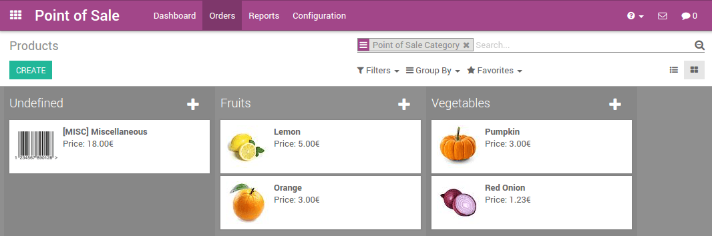

=======================================
Getting started with Odoo Point of Sale
=======================================

Overview
========

Odoo's online Point of Sale application is based on a simple, user
friendly interface. The Point of Sale application can be used online or
offline on iPads, Android tablets or laptops.

Odoo Point of Sale is fully integrated with the Inventory and Accounting
applications. Any transaction in your point of sale will be
automatically registered in your stock and accounting entries but also
in your CRM as the customer can be identified from the app.

You will be able to run real time statistics and consolidations across
all your shops without the hassle of integrating several external
applications.

Configuration
=============

Install the Point of Sale application
-------------------------------------

Go to Apps and install the Point of Sale application.

.. image:: media/start01.png
   :align: center

.. tip::
   If you are using Odoo Accounting, do not forget to install a chart of
   accounts if it's not already done. This can be achieved in the
   accounting settings.

Make products available in the Point of Sale
--------------------------------------------

To make products available for sale in the Point of Sale, open a
product, go in the tab Sales and tick the box "Available in Point of
Sale".

.. image:: media/start02.png
   :align: center

.. tip::
   You can also define there if the product has to be weighted with a
   scale.

Configure your payment methods
------------------------------

To add a new payment method for a Point of Sale, go to
:menuselection:`Point of Sale --> Configuration --> Point of Sale --> Choose
a Point of Sale --> Go to the Payments section` and click on the link
"Payment Methods".

.. image:: media/start03.png
   :align: center

Now, you can create new payment methods. Do not forget to tick the box
"Use in Point of Sale".

Once your payment methods are created, you can decide in which Point of
Sale you want to make them available in the Point of Sale configuration.

.. image:: media/start05.png
   :align: center

Configure your Point of Sale
----------------------------

Go to :menuselection:`Point of Sale --> Configuration --> Point of Sale`
and select the Point of Sale you want to configure. From this menu, you
can edit all the settings of your Point of Sale.

Create your first PoS session
=============================

Your first order
----------------

You are now ready to make your first sales through the PoS. From the PoS
dashboard, you see all your points of sale and you can start a new
session.

.. image:: media/start06.png
   :align: center

You now arrive on the PoS interface.

.. image:: media/start07.png
   :align: center

Once an order is completed, you can register the payment. All the
available payment methods appear on the left of the screen. Select the
payment method and enter the received amount. You can then validate the
payment.

You can register the next orders.

Close the PoS session
---------------------

At the end of the day, you will close your PoS session. For this, click
on the close button that appears on the top right corner and confirm.
You can now close the session from the dashboard.

.. image:: media/start08.png
   :align: center

.. tip::
   It's strongly advised to close your PoS session at the end of each day.

You will then see a summary of all transactions per payment method.

.. image:: media/start09.png
   :align: center

You can click on a line of that summary to see all the orders that have
been paid by this payment method during that PoS session.

If everything is correct, you can validate the PoS session and post the
closing entries.

It's done, you have now closed your first PoS session.

.. tip::
   To connect the PoS to hardware with an Odoo IoT Box, please see the section
   :doc:`../../../iot/config/connect` and :doc:`../../../iot/config/pos`
