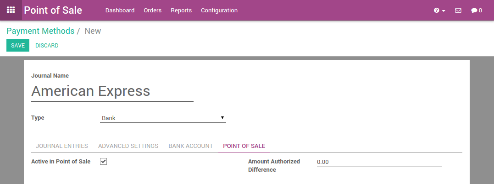
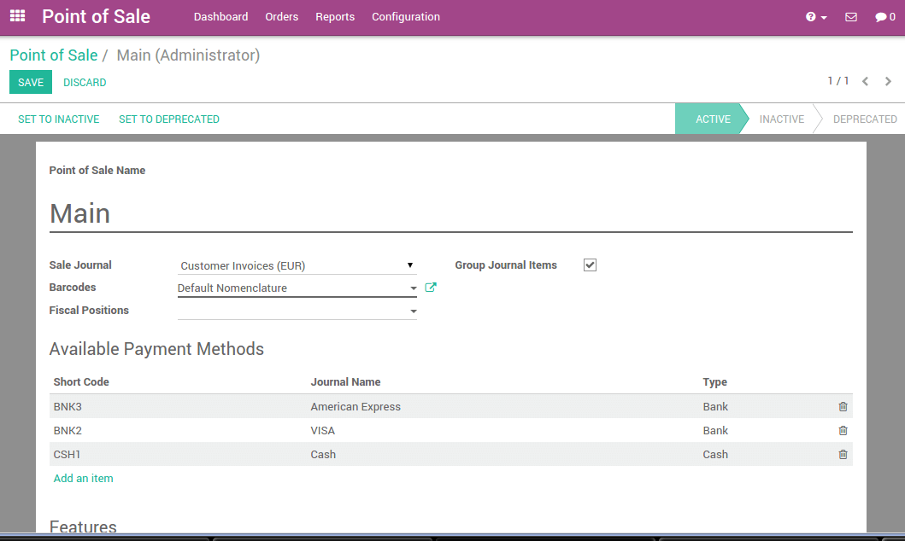

=======================================
Getting started with Odoo Point of Sale
=======================================

Overview
========

Odoo's online **Point of Sale** application is based on a simple, user
friendly interface. The **Point of Sale** application can be used online or
offline on iPads, Android tablets or laptops.

Odoo **Point of Sale** is fully integrated with the **Inventory** and the
**Accounting** applications. Any transaction with your point of sale will
automatically be registered in your inventory management and accounting
and, even in your **CRM** as the customer can be identified from the app.

You will be able to run real time statistics and consolidations across
all your shops without the hassle of integrating several external
applications.

Configuration
=============

Install the Point of Sale Application
-------------------------------------

Start by installing the **Point of Sale** application. Go to 
:menuselection:`Apps` and install the **Point of Sale** application.

.. image:: media/start01.png
    :align: center

Do not forget to install an accounting **chart of account**. If it is not
done, go to the **Invoicing/Accounting** application and click on **Browse
available countries**:

.. image:: media/start02.png
    :align: center

Then choose the one you want to install.

When it is done, you are all set to use the point of sale.

Adding Products
---------------

To add products from the point of sale **Dashboard** go to 
:menuselection:`Orders --> Products` and click on **Create**.

The first example will be oranges with a price of ``3€/kg``. In the **Sales**
tab, you can see the point of sale configuration. There, you can set a
product category, specify that the product has to be weighted or not and
ensure that it will be available in the point of sale.

.. image:: media/start03.png
    :align: center

In same the way, you can add lemons, pumpkins, red onions, bananas... in
the database.

.. tip::
    How to easily manage categories?

    If you already have a database with your products, you can easily set a
    **Point of Sale Category** by using the Kanban view and by grouping the
    products by **Point of Sale Category**.

.. image:: media/start04.png
    :align: center

Configuring a payment method
----------------------------

To configure a new payment method go to 
:menuselection:`Configuration --> Payment methods`
and click on **Create**.

After you set up a name and the type of payment method, you can go to
the point of sale tab and ensure that this payment method has been
activated for the point of sale.

Configuring your points of sales
--------------------------------

Go to :menuselection:`Configuration --> Point of Sale`, 
click on the ``main`` point of sale. Edit the point of sale 
and add your custom payment method into the available payment methods. 

You can configure each point of sale according to your hardware,
location,...

.. demo:fields:: point_of_sale.action_pos_config_pos

Now you are ready to make your first steps with your point of sale.

First Steps in the Point of Sale
================================

Your first order
----------------

On the dashboard, you can see your points of sales, click on **New
session**:

.. image:: media/start07.png
    :align: center

You will get the main point of sale interface:

.. image:: media/start08.png
    :align: center

On the right you can see the products list with the categories
on the top. If you click on a product, it will be added in the cart. You
can directly set the correct quantity or weight by typing it on the
keyboard.

Payment
-------

Once the order is completed, click on **Payment**. You can choose the
customer payment method. In this example, the customer owes you ``10.84 €``
and pays with a ``20 €`` note. When it's done, click on **Validate**.

.. image:: media/start09.png
    :align: center

Your ticket is printed and you are now ready to make your second order.

Closing a session
-----------------

At the end of the day, to close the session, click on the **Close** button
on the top right. Click again on the close button of the point of sale.
On this page, you will see a summary of the transactions

.. image:: media/start10.png
    :align: center

If you click on a payment method line, the journal of this method
appears containing all the transactions performed.

.. image:: media/start11.png
    :align: center

Now, you only have to validate and close the session.

.. seealso::
    * :doc:`../shop/cash_control`
    * :doc:`../shop/invoice`
    * :doc:`../shop/refund`
    * :doc:`../shop/seasonal_discount`