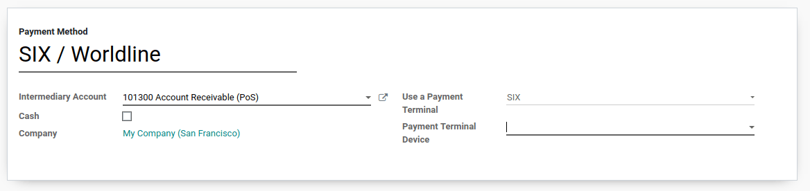

=================================
Connect SIX/Worldline to your PoS
=================================

Connecting a SIX/Worldline payment terminal allows you to offer a fluid
payment flow to your customers and ease the work of your cashiers.

.. note::
   Please note SIX/Worldine is currently only available for UE customers.

Configuration
=============

Connect a Payment Terminal
--------------------------

Connecting a SIX/Worldline Payment Terminal to Odoo is a feature that
requires an IoT Box. For more information on how to connect an IoT Box
to your database, please refer to `this documentation
<https://www.odoo.com/documentation/user/12.0/iot.html>`__.

Once the *IoT Box* is up and running, you’ll need to link it to your
PoS. Open the Point of Sale app and go to :menuselection:`Configuration
--> Point of Sale`. Select a PoS, tick the IoT Box Device option and select
your payment terminal.

.. image:: media/six_01.png
    :align: center

Then go to your *IoT Box homepage* (accessible from the IoT Box form
view in Odoo) and enter the ID of your Six payment terminal.

.. image:: media/six_02.png
    :align: center

You should now see that the terminal is connected to your IoT Box (it
takes +/- 1 min).

.. tip::
   The terminal should only be connected to the network with the Ethernet.
   Do not connect it to the IoT Box with a USB Cable.

Configure the Payment Method
----------------------------

First, go in the general settings of the POS app, and activate the SIX
setting.

Back in :menuselection:`Point of Sale --> Configuration --> Point of Sale`,
go in the payments section and access your payment methods. Create a new
payment method for SIX, select the payment terminal option SIX, and select
your payment terminal device.

Pay with a Payment Terminal
===========================

In your PoS interface, at the moment of the payment, select a payment
method using a payment terminal. Verify that the amount in the tendered
column is the one that has to be sent to the payment terminal and click
on *Send*. If you want to cancel the payment request, click on cancel.

.. image:: media/six_06.png
    :align: center

When the payment is done, the status will change to *Payment
Successful*. You can always reverse the last transaction by clicking on
*Reverse*.

If there is any issue with the payment terminal, you can still force the
payment using the *Force Done*. This will allow you to validate the
order in Odoo even if the connexion between the terminal and Odoo
encounters issues.

Close your Session
==================

At the end of the day, before closing your session, you need to send the
balance of the payments to SIX. To do that, click on this button.

Once the balance has been sent, the SIX shift is closed, meaning you
cannot do additional operations with the SIX payment terminal (except if
you reopen a shift by clicking on the user name and selecting a
cashier).

Once your payment is processed, on the payment record, you’ll find the
type of card that has been used and the transaction ID.

