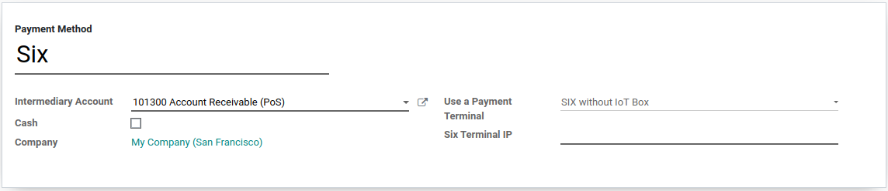
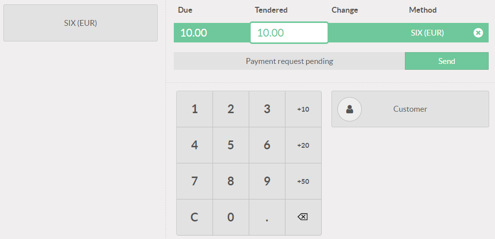

====================================================
Connect a SIX Payment Terminal to your PoS
====================================================

Connecting a SIX payment terminal allows you to offer a fluid
payment flow to your customers and ease the work of your cashiers.

.. warning::
   Even though Worldline has recently acquired SIX Payment Services and both
   companies use Yomani payment terminals, the firmware they run is different.
   Terminals received from Worldline are therefore not compatible with this
   integration.

Configuration
=============

Configure the Payment Method
----------------------------

First, make sure that the POS Six module is installed. For this, go to *Apps*,
remove the "Apps" filter and search for "POS Six".

.. image:: media/six_01.png
    :align: center

Back in :menuselection:`Point of Sale --> Configuration --> Payment Methods`,
Create a new payment method for SIX, select the payment terminal option
"SIX without IoT Box", and enter your payment terminal IP address.

Pay with a Payment Terminal
===========================

In your PoS interface, at the moment of the payment, select a payment
method using a payment terminal. Verify that the amount in the tendered
column is the one that has to be sent to the payment terminal and click
on *Send*. If you want to cancel the payment request, click on cancel.

When the payment is done, the status will change to *Payment
Successful*. You can always reverse the last transaction by clicking on
*Reverse*.

.. image:: media/six_07.png
    :align: center

If there is any issue with the payment terminal, you can still force the
payment using the *Force Done*. This will allow you to validate the
order in Odoo even if the connexion between the terminal and Odoo
encounters issues.
