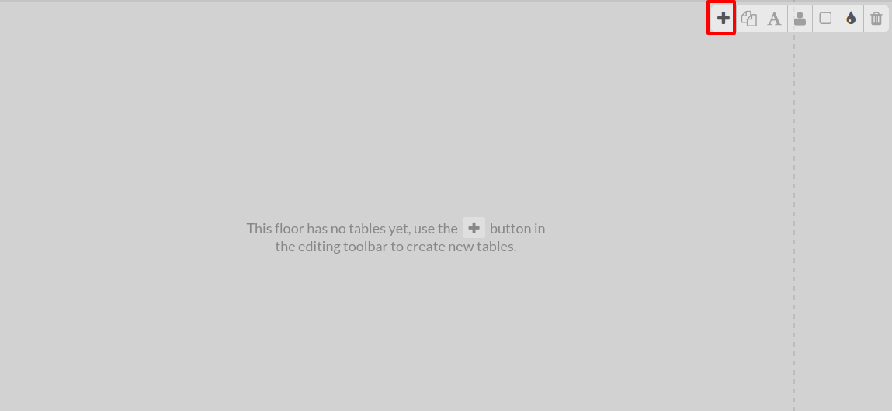
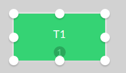

===============================
Configure your table management
===============================

Once your point of sale has been configured for bar/restaurant usage,
select *Table Management* in :menuselection:`Point of Sale --> Configuration --> Point of sale`..

Add a floor
===========

When you select *Table management* you can manage your floors by
clicking on *Floors*

.. image:: media/table01.png
    :align: center

Add tables
==========

From your PoS interface, you will now see your floor(s).

When you click on the pencil you will enter into edit mode, which will
allow you to create tables, move them, modify them, ...

In this example I have 2 round tables for six and 2 square tables for
four, I color coded them to make them easier to find, you can also
rename them, change their shape, size, the number of people they hold as
well as duplicate them with the handy tool bar.

Once your floor plan is set, you can close the edit mode.

Register your table(s) orders
=============================

When you select a table, you will be brought to your usual interface to
register an order and payment.

You can quickly go back to your floor plan by selecting the floor button
and you can also transfer the order to another table.

