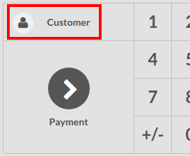
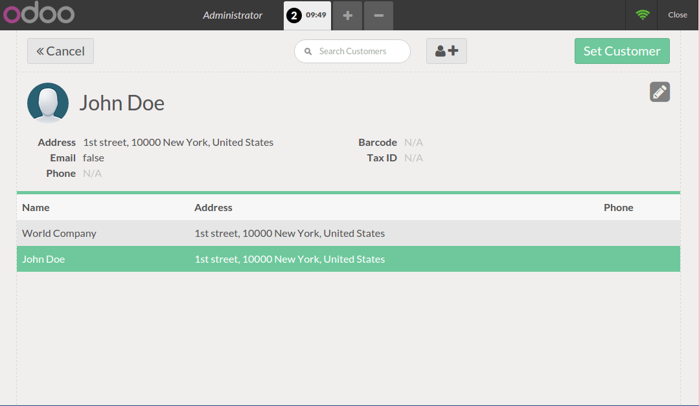
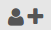
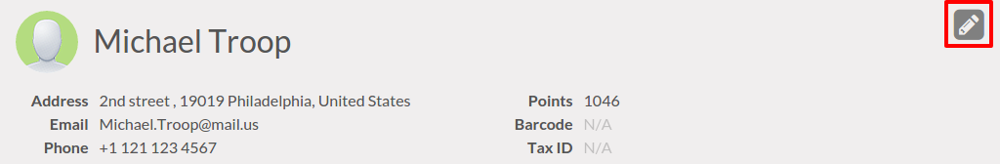
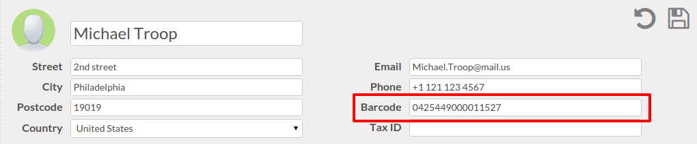

======================================
How to invoice from the POS interface?
======================================

Register an order
=================

On the **Dashboard**, you can see your points of sales, click on **New
session**:

.. image:: media/invoice01.png
    :align: center

You are on the ``main`` point of sales view :

.. image:: media/invoice02.png
    :align: center

On the right you can see the list of your products with the categories
on the top. Switch categories by clicking on it.

If you click on a product, it will be added in your cart. You can
directly set the correct **Quantity/Weight** by typing it on the keyboard.

Add a customer
==============

By selecting in the customer list
---------------------------------

On the main view, click on **Customer** (above **Payment**):

You must set a customer in order to be able to issue an invoice.

You can search in the list of your customers or create new ones by
clicking on the icon.

.. note::
    For more explanation about adding a new customer. Please read the
    document :doc:`../advanced/register`.

By using a barcode for customer
-------------------------------

On the main view, click on **Customer** (above **Payment**):

Select a customer and click on the pencil to edit.

Set a the barcode for customer by scanning it.

Save modifications and now when you scan the customer's barcode, he is assigned
to the order

.. note::
    Be careful with the **Barcode Nomenclature**. By default, customers' barcodes 
    have to begin with 042. To check the default barcode nomenclature, go to
    :menuselection:`Point of Sale --> Configuration --> Barcode Nomenclatures`.

    .. image:: media/invoice11.png
        :align: center

Payment and invoicing
=====================

Once the cart is processed, click on **Payment**. You can choose the
customer payment method. In this example, the customer owes you ``10.84 €``
and pays with by a ``VISA``.

Before clicking on **Validate**, you have to click on **Invoice** in order to
create an invoice from this order.

.. image:: media/invoice06.png
    :align: center

Your invoice is printed and you can continue to make orders.

Retrieve invoices of a specific customer
========================================

To retrieve the customer's invoices, go to the **Sale** application, click
on :menuselection:`Sales --> Customers`.

On the customer information view, click on the **Invoiced** button :

You will get the list all his invoices. Click on the invoice to get the
details.

.. image:: media/invoice08.png
    :align: center

.. seealso::
    * :doc:`cash_control`
    * :doc:`../advanced/register`
    * :doc:`refund`
    * :doc:`seasonal_discount`
