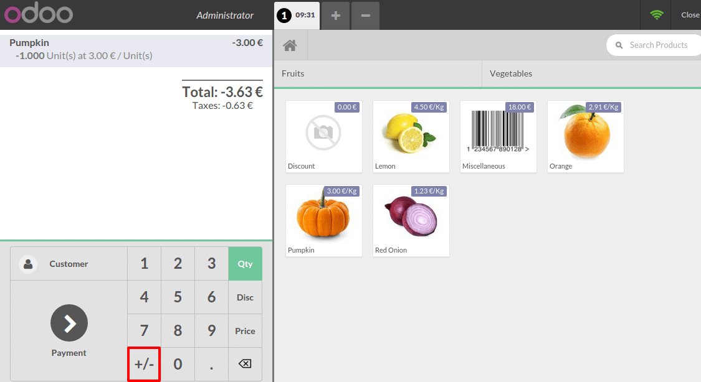

==================================
Accept returns and refund products
==================================

Having a well-thought-out return policy is key to attract - and keep -
your customers. Making it easy for you to accept and refund those
returns is therefore also a key aspect of your *Point of Sale*
interface.

From your *Point of Sale* interface, select the product your customer
wants to return, use the +/- button and enter the quantity they need to
return. If they need to return multiple products, repeat the process.

As you can see, the total is in negative, to end the refund you simply
have to process the payment.

