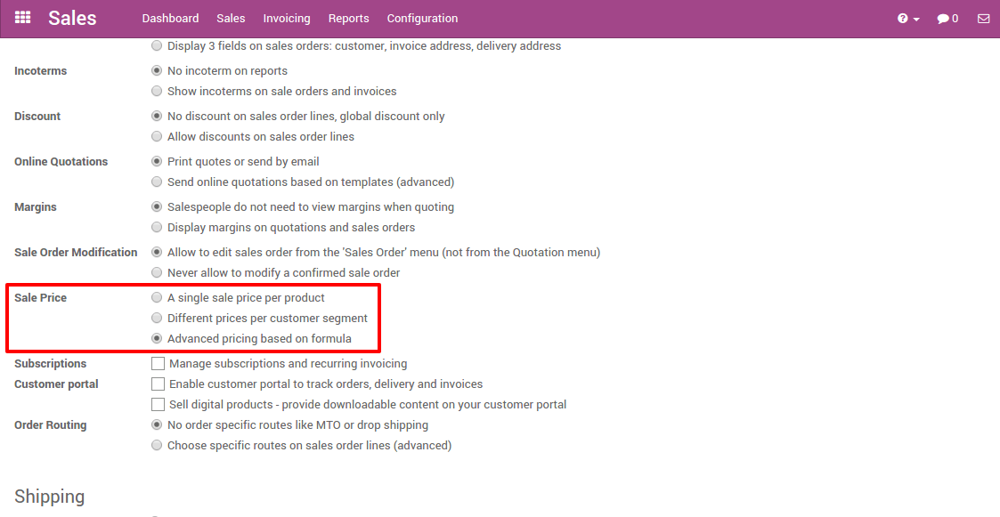

============================
Apply time-limited discounts
============================

Entice your customers and increase your revenue by offering time-limited
or seasonal discounts. Odoo has a powerful pricelist feature to support
a pricing strategy tailored to your business.

Configuration
=============

To activate the *Pricelists* feature, go to :menuselection:`Point of
Sales --> Configuration --> Point of sale` and select your PoS interface.

Choose the pricelists you want to make available in this Point of Sale
and define the default pricelist. You can access all your pricelists by
clicking on *Pricelists*.

Create a pricelist
==================

By default, you have a *Public Pricelist* to create more, go to
:menuselection:`Point of Sale --> Catalog --> Pricelists`

.. image:: media/seasonal_discount02.png
    :align: center

You can set several criterias to use a specific price: periods, min.
quantity (meet a minimum ordered quantity and get a price break), etc.
You can also chose to only apply that pricelist on specific products or
on the whole range.

Using a pricelist in the PoS interface
======================================

You now have a new button above the *Customer* one, use it to
instantly select the right pricelist.

You can see the price is instantly updated to reflect the pricelist. You
can finalize the order in your usual way.

.. note::
    If you select a customer with a default pricelist, it will be
    applied. You can of course change it.
