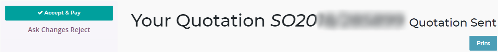
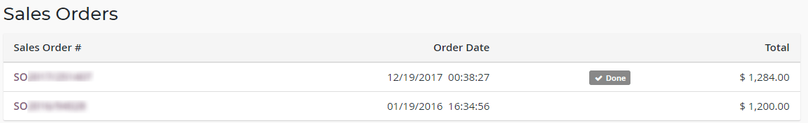
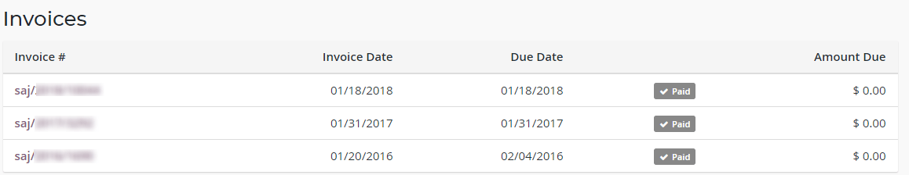
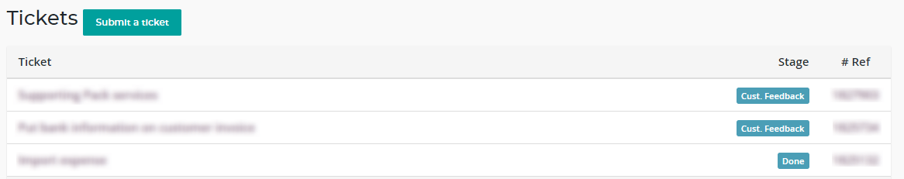
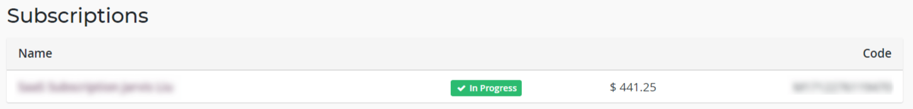

:banner: banners/my_odoo_portal.jpg

==============
My Odoo Portal
==============

In this section of the portal you will find all the communications between you
and Odoo, documents such Quotations, Sales Orders, Invoices and your Subscriptions.

.. note :: To access this section you have to log with your username and password
    to `Odoo <https://www.odoo.com/my/home>`__ . If you are already logged-in just
    click on your name on the top-right corner and select "My Account".

.. image:: media/my_portal.png
    :align: center

Quotations
==========

Here you will find all the quotations sent to you by Odoo. For example, a
quotation can be generated for you after adding an Application or a User to your
database or if your contract has to be renewed.

.. image:: media/quotations.png
    :align: center

The *Valid Until* column shows until when the quotation is valid; after that date
the quotation will be "Expired". By clicking on the quotation you will see all
the details of the offer, the pricing and other useful information.

If you want to accept the quotation just click "Accept & Pay" and the quote
will get confirmed. If you don't want to accept it, or you need to ask for some
modifications, click on "Ask Changes Reject".

Sales Orders
============

All your purchases within Odoo such as Upsells, Themes, Applications, etc.
will be registered under this section.

By clicking on the sale order you can review the details of the products purchased
and process the payment.

Invoices
========

All the invoices of your subscription(s), or generated by a sales order, will be
shown in this section. The tag before the Amount Due will indicate you if the
invoice has been paid.

Just click on the Invoice if you wish to see more information, pay the invoice
or download a PDF version of the document.

Tickets
=======

When you submit a ticket through `Odoo Support <https://www.odoo.com/help>`__
a ticket will be created. Here you can find all the tickets that you have opened,
the conversation between you and our Agents, the Status of the ticket and the ID
(# Ref).

Subscriptions
=============

You can access to your Subscription with Odoo from this section. The first page
shows you the subscriptions that you have and their status.

By clicking on the Subscription you will access to all the details regarding your
plan: this includes the number of applications purchased, the billing information
and the payment method.

To change the payment method click on "Change Payment Method" and enter the new
credit card details.

.. image:: media/changemethod.png
    :align: center

If you want to remove the credit cards saved, you can do it by clicking on
"Manage you payment methods" at the bottom of the page. Click then on "Delete" to
delete the payment method.

.. image:: media/managepayment.png
    :align: center

.. warning :: At the date of the next invoice, if there is no payment
    information provided or if your credit card has expired, the status of your
    subscription will change to "To Renew".  You will then have 7 days to
    provide a valid method of payment. After this delay, the subscription will
    be closed and you will no longer be able to access the database.

Success Packs
=============
With a Success Pack/Partner Success Pack, you are assigned an expert to provide
unique personalized assistance to help you customize your solution and optimize
your workflows as part of your initial implementation. These hours never expire
allowing you to utilize them whenever you need support.

.. seealso ::
    If you need information about how to manage your database see :ref:`db_online`
