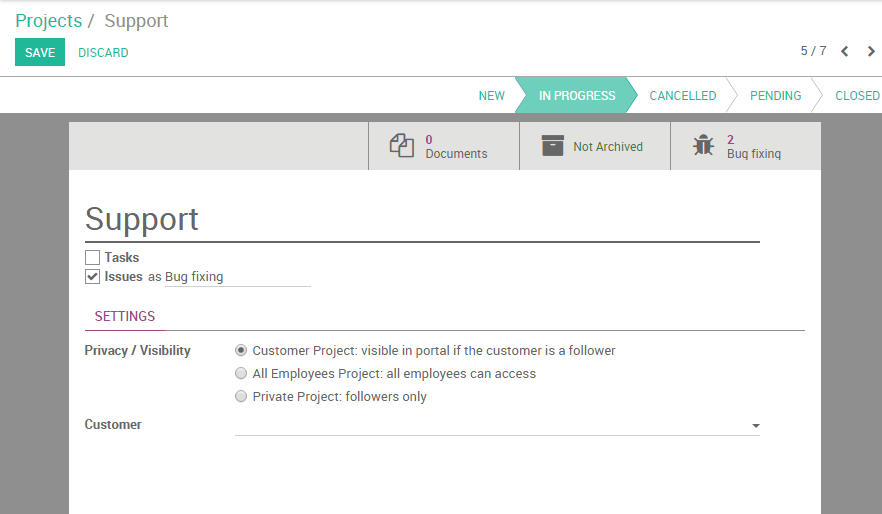

============================================
How to use projects to handle claims/issues?
============================================

A company selling support services often has to deal with problems
occurring during the implementation of the project. These issues have to
be solved and followed up as fast as possible in order to ensure the
deliverability of the project and a positive customer satisfaction.

For example, as an IT company offering the implementation of your
software, you might have to deal with customers emails experiencing
technical problems. Odoo offers the opportunity to create dedicated
support projects which automatically generate tasks upon receiving an
customer support email. This way, the issue can then be assigned
directly to an employee and can be closed more quickly.

Configuration
=============

The following configuration are needed to be able to use projects for
support and issues. You need to install the **Project management** and the
**Issue Tracking** modules.

.. image:: media/claim_issue01.png
    :align: center

.. image:: media/claim_issue02.png
    :align: center

Create a project 
=================

The first step in order to set up a claim/issue management system is to
create a project related to those claims. Let's start by simply creating
a **support project**. Enter the Project application dashboard, click on
create and name your project **Support**. Tick the **Issues** box and rename
the field if you want to customize the Issues label (e.g. **Bugs** or
**Cases**). As issues are customer-oriented tasks, you might want to set
the Privacy/Visibility settings to **Customer project** (therefore your
client will be able to follow his claim in his portal).

.. note::
    You can link the project to a customer if the project has been 
    created to handle a specific client issues, otherwise you can 
    leave the field empty.

Invite followers
----------------

You can decide to notify your employees as soon as a new issue will be
created. On the **Chatter** (bottom of the screen), you will notice two
buttons on the right : **Follow** (green) and **No follower** (white). Click on
the first to receive personally notifications and on the second to add
others employees as follower of the project (see screenshot below).

Set up your workflow
--------------------

You can easily personalize your project stages to suit your workflow by
creating new columns. From the Kanban view of your project, you can add
stages by clicking on **Add new column** (see image below). If you
want to rearrange the order of your stages, you can easily do so by
dragging and dropping the column you want to move to the desired
location. You can also edit, fold or unfold anytime your stages by using
the **setting** icon on your desired stage.

.. image:: media/claim_issue05.png
    :align: center

Generate issues from emails
===========================

When your project is correctly set up and saved, you will see it
appearing in your dashboard. Note that an email address for that project
is automatically generated, with the name of the project as alias.

.. note:: 
    If you cannot see the email address on your project, go to the menu
    :menuselection:`Settings --> General Settings` and configure your 
    alias domain. Hit **Apply** and go back to your **Projects** dashboard 
    where you will now see the email address under the name of your project.

Every time one of your client will send an email to that email address,
a new issue will be created.

.. seealso::
    * :doc:`../configuration/setup`
    * :doc:`../configuration/collaboration`
