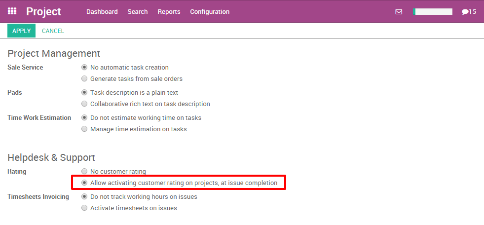
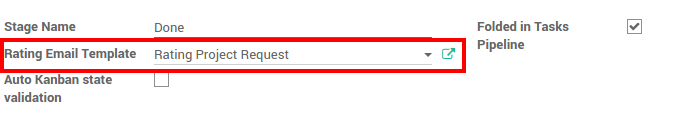
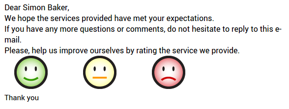
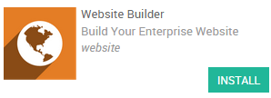

======================================
How to gather feedback from customers?
======================================

Overview
========

As a manager, it's not always simple to follow everything your teams do.
Having a simple customer feedback can be very interesting to evaluate
the performances of your teams. You can very easily gather feedbacks
from your customers using Odoo.

An e-mail can be sent during the project to get the customer feedbacks.
He just has to choose between 3 smileys to assess your work (Smile,
Neutral or Sad).

How to gather feedbacks from customers
======================================

Before getting started some configuration is necessary. First of all
it's necessary to install the **Project** application. To do so simply
go to the apps module and install it.

.. image:: media/feedback01.png
    :align: center

Moreover, in the same menu, you have to install the **Project Rating**
module.

.. image:: media/feedback02.png
    :align: center

Next, go back into the back-end and enter the project module. Select the
**Configuration** button and click on **Settings** in the dropdown menu. Next
select **Allow activating customer rating on projects, at issue
completion**. Don't forget to apply your changes.

How to get a Customer feedback?
===============================

A e-mail can be sent to the customers at each stage of the ongoing
projects.

First, you need to choose for which projects you want to get a feedback.

Project configuration
---------------------

Go to the **Project** application, in the project settings select the
**Customer satisfaction** option.

.. image:: media/feedback04.png
    :align: center

Email Template
--------------

Go to the stage settings (click on the gear icon on the top of the stage
column, then select **Edit**). Choose the e-mail template that will be used.
You can directly edit it from there.

Here is an email example that a customer can receive :

.. note::
    The customer just has to click on a smiley (Smile, Neutral or
    Sad) to assess your work. The customer can reply to the email to add
    more information. It will be added to the chatter of the task.

Reporting
---------

You have a brief summary on the satisfaction in the upper right corner
of the project.

.. image:: media/feedback07.png
    :align: center

How to display the ratings on your website?
===========================================

First of all it's necessary to install the **Website Builder** application.
To do so simply go to the apps module and search for the website
builder.

Moreover, in the same menu, you have to install the **Website Rating
Project Issue** module.

.. image:: media/feedback09.png
    :align: center

Then, you will be able to publish your result on your website by
clicking on the website button in the upper right corner and confirming
it in the front end of the website.

.. image:: media/feedback10.png
    :align: center
