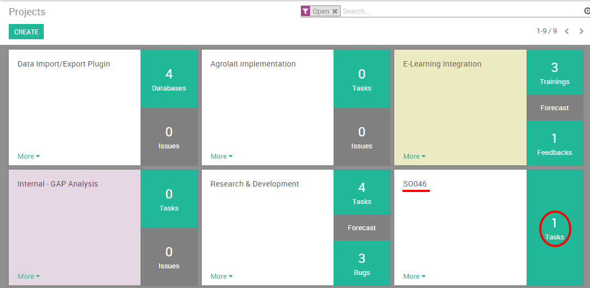

======================================
How to create tasks from sales orders?
======================================

In this section, we will see the integration between Odoo's **Project
management** and **Sales** modules and more precisely how to generate tasks
from sales order lines.

In project management, a task is an activity that needs to be
accomplished within a defined period of time. For a company selling
services, the task typically represents the service that has been sold
to the customer and that needs to be delivered. This is why it is useful
to be able to generate a task from a sale order in order to streamline
the process between the Sales and Services departments.

As an example, you may sell a pack of ``50 Hours`` of support at ``$25,000``.
The price is fixed and charged initially. But you want to keep track of
the support service you did for the customer. On the sale order, the
service will trigger the creation of a task from which the consultant
will record timesheets and, if needed, reinvoice the client according to
the overtime spent on the project.

Configuration
=============

Install the required applications
---------------------------------

In order to be able to generate a task from a sale order you will need
to install the **Sales Management** and **Project** application. Simply go into
the application module and install the following:

.. image:: media/so_to_task01.png
    :align: center

And finally, the **Timesheet** app, Timesheet will not only let you create a task from a Sales order, but also invoice your customer based on the time spent on that task. 

Simply go into the application module and install the following:

.. image:: media/so_to_task03.png
    :align: center

Create and set up a product
===========================

You need to configure your service on the product form itself in order
to generate a task every time it will be sold. From the **Sales** module,
use the menu :menuselection:`Sales --> Products` and create a new 
product with the`following setup:

-   **Name**: Technical Support

-   **Product Type**: Service

-   **Unit of Measure**: Hours (go to :menuselection:`Configuration --> Settings`
    and, under **Unit of measures**, check the **Some products may be
    sold/purchased in different unit of measures (advanced)** radio
    button)

-   **Invoicing policy**: You can set up your invoice policy either on
    ordered quantity or on delivered quantity. You can easily follow
    the amount of hours that were delivered and/or invoiced to your
    client.

-   **Track Service**: Create a task and track hours, as your product
    is a service invoiceable by hours you have to set the units of
    measures of the product to hours as well.

.. image:: media/so_to_task04.png
    :align: center

.. note::
    Link your task to an existing project or create a new one on the fly if 
    the product is specific to one project. Otherwise, you can leave it 
    blank, odoo will then create a project per SO.

Create the Sales Order
======================

Once the product is set up, you can create a quotation or a sale order
with the related product. Once the quotation is confirmed and
transformed into a sale order, the task will be created.

.. image:: media/so_to_task05.png
    :align: center

Access the task generated from the sale order
=============================================

On the Project module, your new task will appear :

-   either on a related project if you have selected one in the product
    form

-   either on a new project with the name of related the sale order as
    title (you can easily change the name of the project by clicking
    on :menuselection:`More --> Settings`)

On the task itself, you will now be able to record timesheets and to
invoice your customers based on your invoicing policy.

.. note::
    On Odoo, the central document is the sales order, which means that 
    the source document of the task is the related sales order.

.. seealso::
    * :doc:`../configuration/setup`
    * :doc:`../../sales/invoicing/subscriptions`
