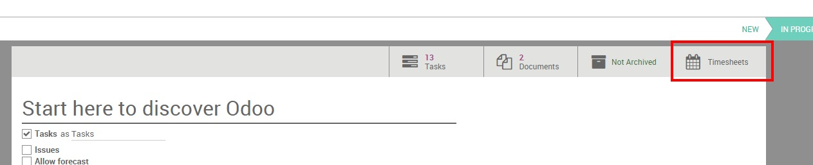
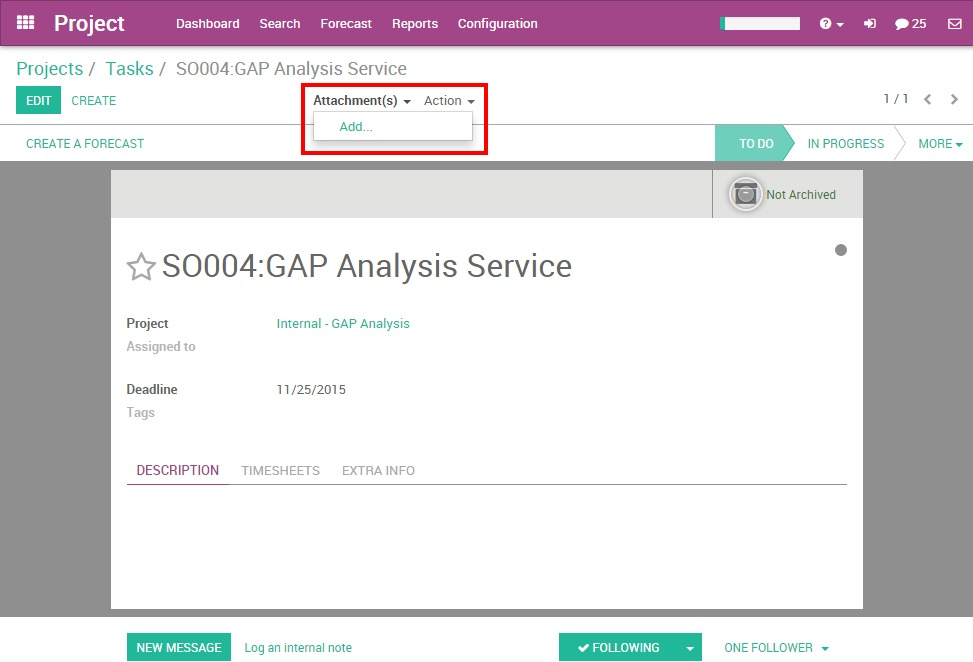
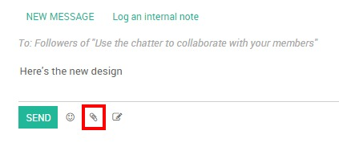
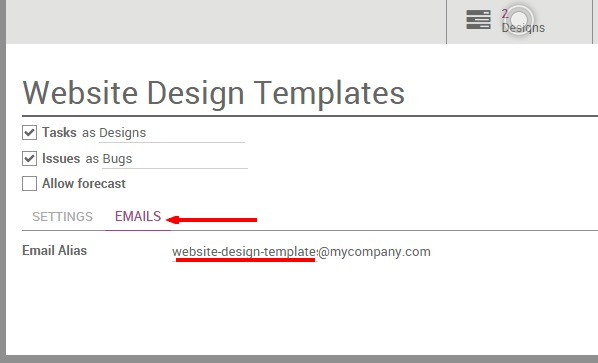
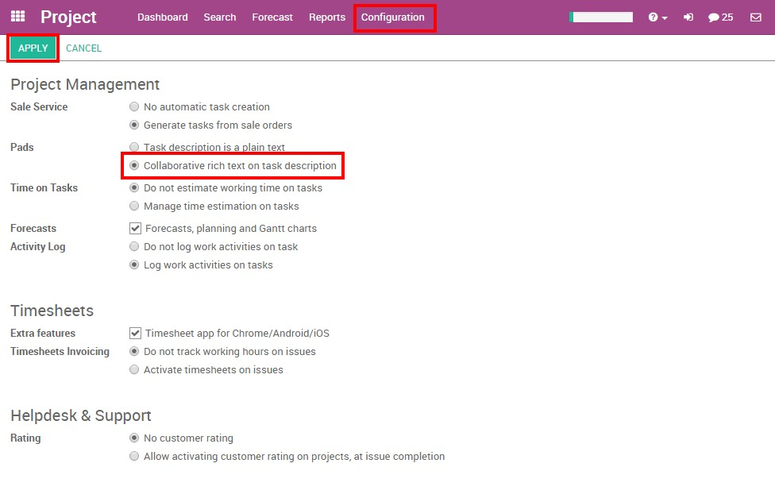
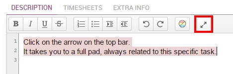
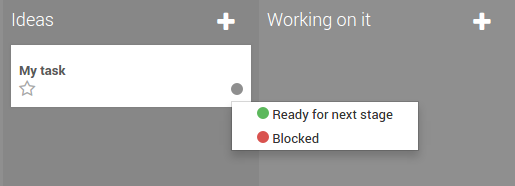
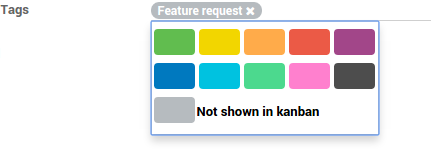

=====================================
How to manage & collaborate on tasks?
=====================================

Responsibilities 
================

In Odoo, you can assign the person who is in charge of the task.

When creating a task, by default you are responsible for it. You can
change this by simply typing the username of someone else and choosing
it from the suggestions in the drop down menu.

.. tip::
    If you add someone new, you can "Create & Edit" a new user on the
    fly. In order to do so, you need the administrator rights.

Followers
=========

In a task, you can add other users as **Followers**. Adding a follower means
that this person will be notified of any changes that might happen in
the task. The goal is to allow outside contribution from the chatter.
This can be invaluable when you need the advice of colleagues from other
departments. You could also invite customers to take part in the task.
They'll be notified by email of the conversation in the chatter, and
will be able to take part in it simply by replying to the mail. The
followers can see the whole task like you, with the description and the
chatter.

Project: follow a project to follow the pipe
--------------------------------------------

You can decide to follow a Project. In this situation, you'll be
notified of any changes from the project: tasks sliding from one stage
to another,conversation taking place,, etc. You'll receive all the
information in your inbox. This feature is perfect for a Project Manager
who wants to see the big picture all the time.

Task: follow a specific task
----------------------------

Following a task is the same idea as following a project, except you are
focused on a specific part of the project. All notifications or changes
in that task also appear in your inbox.

Choose which action to follow
-----------------------------

You can choose what you want to follow by clicking on the down arrow in
the Following button.

By default, you follow the discussions but you can also choose to be
notified when a note is logged in, when a task is created, blocked or
ready to go, and when the stage of the task has changed.

.. image:: media/manage_collaborate01.png
    :align: center

Time management: analytic accounts
==================================

Whether it helps you for estimation of future projects or data for
billing or invoicing, time tracking in Project Management is a real
plus.

The Odoo Timesheet app is perfectly integrated with Odoo Project and can
help you track time easily.

Once Odoo Timesheet is installed, the timesheet option is automatically
available in projects and on tasks.

To avoid any confusion, Odoo works with analytic accounts. An analytic
account is the name that will always be the reference for a specific
project or contract. Each time a project is created, an analytic account
is automatically created under the same name.

Record a timesheet on a project: 
---------------------------------

Click on the settings of a project.

.. image:: media/manage_collaborate02.png
    :align: center

Click on the Timesheet button in the top grey menu.

You get the Odoo Timesheet. Click on Create and a line will appear with
today's date and time. Your project name is automatically selected as
the Analytic Account. No task is set, you can choose to add a specific
task for it, or not.

.. image:: media/manage_collaborate04.png
    :align: center

If you go now to Odoo Timesheet, your line will be recorded among your
other timesheets.

Record a timesheet on a task: 
------------------------------

Within a task, the timesheet option is also available.

In the task, click on the Edit button. Go on the Timesheet tab and click
on Add an item.

A line will appear with the name of the project already selected in the
Analytic account.

Again, you'll find back these timesheet lines in the Odoo Timesheet
application.

.. image:: media/manage_collaborate05.png
    :align: center

At the end of your project, you can get a real idea of the time you
spent on it by searching based on the Analytic Account name of your
project.

Document Management in tasks
============================

You can manage documents related to tasks whether they're plans,
pictures of the formatting, etc. An image is sometimes more informative
than a thousand words! You have two ways to add a document to a task.

1. You can add an image/document to your task by clicking on the
Attachment tab on the top of the form.

2. You can add an image/document to your task through the Chatter. You
can log a note/send a message and attach a file to it. Or if someone
sends an email with an attachment, the document will be automatically
saved in the task.

.. tip:: 
    If you have an important image that helps to understand the tasks you 
    can set it up as Cover Image. It'll show up in the Kanban view directly.

.. image:: media/manage_collaborate08.png
    :align: center

Collaborate on tasks
====================

Tasks in Odoo Project are made to help you to work easily together with
your colleagues. This helps you save time and energy.

The idea is to stay up to date with what interests you. You can
collaborate with your colleagues by writing on the same task at the same
time, with task delegation and the Chatter.

Create a task from an email
---------------------------

You can configure an email address linked to your project. When an email
is sent to that address, it automatically creates a task in the first
step of the project, with all the recipients (To/Cc/Bcc) as followers.

With Odoo Online, the mail gateway is already configured and so every
project gets an automatic email address.

The email is always the name of the project (with "-" instead of the
space), you'll see it under the name of your project in the Project
Dashboard.

.. image:: media/manage_collaborate09.png
    :align: center

This email address create by default following the project name can be
changed.

The alias of the email address can be changed by the project manager.

To do so, go to the Project Settings and click on the Email Tab.

You can directly edit your project email address.

The Chatter, status and follow-up.
----------------------------------

The Chatter is a very useful tool. It is a communication tool and shows
the history of the task.

In the Chatter, you can see when the task has been created, when it has
passed from one stage to another, etc. Any changes made to that task are
logged into the Chatter automatically by the system. It also includes
the history of the interaction between you and your customer or
colleagues. All interactions are logged on the chatter, making it easy
for the task leader to remember past interactions.

You can interact with followers whether there are internal (your
colleagues) or external (the client for example) by logging a note or
important information. Also, if you want to send an email to all the
followers of that specific task, you can choose to add a message to
notify all of them. For both of these options, the date and time is
saved on the entry.

.. image:: media/manage_collaborate11.png
    :align: center

The description of the task, the Pad
------------------------------------

Odoo allows you to replace the task description field by an Etherpad
collaborative note (http://etherpad.org). This means that you can
collaborate on tasks in real time with several users contributing to the
same content. Every user has their own color and you can replay the
whole creation of the content.

To activate this option, go to :menuselection:`Project Settings --> Pads`, 
tick "Collaborative rich text on task description".

.. tip::
    If you just need the pad and not the whole task page, you can click 
    on the icon on the top right to get to the pad directly in a full 
    screen view. Click on the ``</>`` icon to get the direct URL of the task 
    description: useful if you want to send it to someone without adding 
    this person as a follower.

Tasks states
============

Set the state of a task
-----------------------

The status of the task is the easiest way to inform your colleagues when
you are working on a task, if the task is ready or if it is blocked. It
is a visual indicator that is seen in a glance.

You can change the status of the task from the kanban view or directly
from the task. Just click on the status ball to get the choices:

.. image:: media/manage_collaborate15.png
    :align: center

Custom states
-------------

You can decide what the different status mean for each stage of your
project. On the kanban view, click on the gear icon on the top of the
stage, then click on edit:

.. image:: media/manage_collaborate16.png
    :align: center

Next to the color ball, write the explanation of the state.

.. image:: media/manage_collaborate17.png
    :align: center

Now, the explanation will be displayed instead of the generic text:

.. image:: media/manage_collaborate18.png
    :align: center

Color Tags
==========

In every task, you can add a tag. Tags are very useful to categorize the
tasks. It helps you to highlight a task from the Kanban view or better
find them thanks to the filters.

If you are always working with a specific type of tag, you can highlight
the tasks containing the tag with the colors. Each tag can get a
specific color, it's very visual on the Kanban view.

.. image:: media/manage_collaborate19.png
    :align: center

In order to make it appear on the kanban view, you have to set a color
on the tag, directly from the task:

