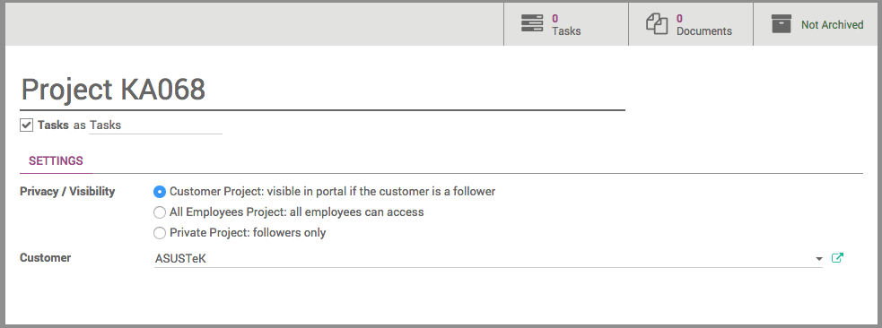
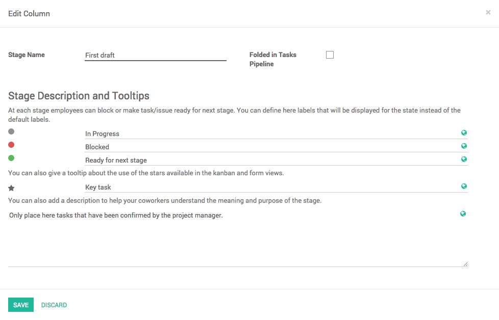

====================================
How to set up & configure a project?
====================================

Overview
========

Odoo Project allows you to manage a project together with your whole
team, and to communicate with any member for each project and task.

It works with projects containing tasks following customizable stages. 
A project can be internal or customer-oriented. A task is something to 
perform as part of a project. You will be able to give different tasks 
to several employees working on this project.

Installing the Project module
=============================

Open the **Apps** module, search for **Project Management**, and click on
**Install**.

.. image:: media/setup01.png
    :align: center

Creating a new project
======================

Open the **Project** application, and click on **Create**. From this window, 
you can specify the name of the project and set up the privacy of the
project.

The privacy setting works as:

-   **Customer Project**: visible in portal if the customer is a
    follower.

-   **All Employees**: employees see all tasks or issues.

-   **Private Project**: followers can see only the followed tasks or
    issues

You can also specify if the project is destined to a customer, or leave
the **Customer** field empty if not.

When you have entered all the required details, click on **Save**.

Manage your project's stages
============================

Add your project's stages
-------------------------

On your project's dashboard. Click on **# Tasks**.

.. image:: media/setup03.png
    :align: center

In the new window, add a new column and name it according to the first
stage of your project, then add as many columns as there are stages in
your project.

.. image:: media/setup04.png
    :align: center

For each stage, there are markers for the status of tasks within a
stage, that you can personalize to fit your needs.

Drag your mouse pointer over a stage name, and click on the appearing
bearing, and on the opening menu, click on **Edit**.

.. image:: media/setup05.png
    :align: center

A new window will open. The color dots and star icon correspond to
customizable markers applied on tasks, making it easier to know what
task requires attention. You can give them any signification you like.

Click on **Save** when you are done.

Rearrange stages
----------------

You can easily personalize this view to better suit your business needs
by creating new columns. From the Kanban view of your project, you can
add stages by clicking on **Add new column**. If you want to rearrange
the order of your stages, you can easily do so by dragging and dropping
the column you want to move to the desired location. You can also fold
or unfold your stages by using the **Setting** icon on your desired stage.

.. image:: media/setup07.png
    :align: center

.. seealso::
    * :doc:`visualization`
    * :doc:`collaboration`
    * :doc:`time_record`
