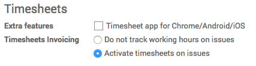
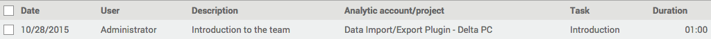
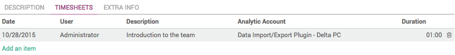

=========================
How to record time spent?
=========================

Overview
========

Odoo allows you to record the time spent per employee and per project,
for simple reports as well as for direct invoicing to the customer.

Configuration
=============

In order to record the time spent on projects, you must first activate
the invoicing of timesheets. Into the **Project** application, open
:menuselection:`Configuration --> Settings`. In the **Timesheets** section 
of the page, tick **Activate timesheets on issues**.

.. note::
    Activating the option will install the Sales, Invoicing, 
    Issue Tracking, Employee and Timesheet apps.

Recording timesheets
====================

You can record the time spent in projects straight from the projects
application. You can either record timesheets in a project, or in a
task.

Recording in a project
----------------------

In the **Project** application dashboard, open the **More** menu of the 
project you want to record timesheets for, and click on **Timesheets**.

.. image:: media/time_record02.png
    :align: center

In the new window, click on **Create** and insert the required details, then
click on **Save**.

Recording in a task
-------------------

In the **Project** app, open the project you want to record timesheets for,
and open the task on which you have been working.

In the task, click on **Edit**, open the **Timesheets** tab and click on **Add
an item**. Insert the required details, then click on **Save**.

