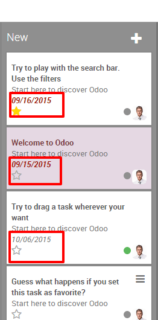

===================================
How to visualize a project's tasks?
===================================

How to visualize a project's tasks

Tasks are assignments that members of your organisations have to fulfill
as part of a project. In day to day business, your company might
struggle due to the important amount of tasks to fulfill. Those task are
already complex enough. Having to remember them all and follow up on
them can be a real burden. Luckily, Odoo enables you to efficiently
visualize and organize the different tasks you have to cope with.

Configuration
=============

The only configuration needed is to install the project module in the
module application.

Creating Tasks
==============

Once you created a project, you can easily generate tasks for it. Simply
open the project and click on create a task.

.. image:: media/visualization02.png
    :align: center

You then first give a name to your task, the related project will
automatically be filled in, assign the project to someone, and select a
deadline if there is one.

Get an overview of activities with the kanban view
--------------------------------------------------

Once you created several tasks, they can be managed and followed up
thanks to the Kanban view.

The Kanban view is a post-it like view, divided in different stages. It
enables you to have a clear view on the stages your tasks are in and
which one have the higher priorities.

The Kanban view is the default view when accessing a project, but if you
are on another view, you can go back to it any time by clicking the
kanban view logo in the upper right corner

.. image:: media/visualization04.png
    :align: center

How to nototify your collegues about the status of a task?
----------------------------------------------------------

Sort tasks by priority
~~~~~~~~~~~~~~~~~~~~~~

On each one of your columns, you have the ability to sort your tasks by
priority. Tasks with a higher priority will be automatically moved to
the top of the column. From the Kanban view, click on the star in the
bottom left of a task to tag it as **high priority**. For the tasks that
are not tagged, Odoo will automatically classify them according to their
deadlines.

Note that dates that passed their deadlines will appear in red (in the
list view too) so you can easily follow up the progression of different
tasks.

Keep an eye on deadlines with the Calendar view
-----------------------------------------------

If you add a deadline in your task, they will appear in the calendar
view. As a manager, this view enables you to keep an eye on all deadline
in a single window.

.. image:: media/visualization07.png
    :align: center

All the tasks are tagged with a color corresponding to the employee
assigned to them. You can easily filter the deadlines by employees by
ticking the related boxes on the right of the calendar view.

.. tip::
    You can easily change the deadline from the Calendar view by 
    dragging and dropping the task to another case.