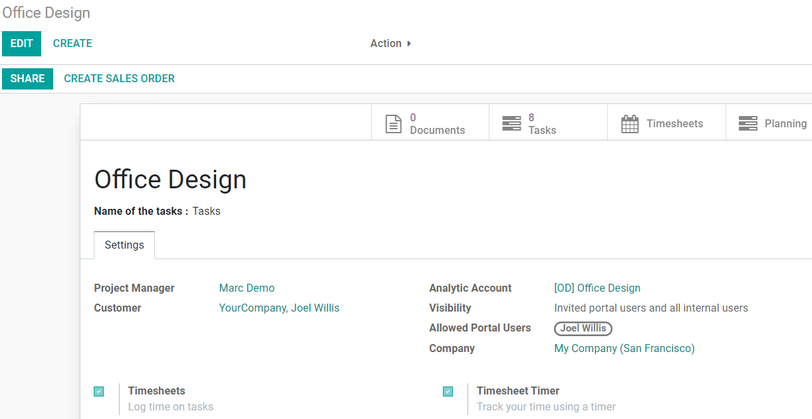

========================
Share Projects and Tasks
========================

When you share your projects/tasks, you allow external users to be on the same page as you.
It avoids misunderstandings, simplifies communication, and allows you to become a more coordinated
company as you get the right information to the right people.

Share projects and tasks
========================

To share a project, go to :menuselection:`Manage --> Share`.

.. image:: media/share_project.png
   :align: center
   :height: 270
   :alt: Edit a project from the dashboard view and click on share in Odoo Project

To share a task, open it and click on :menuselection:`Action --> Share`. Choose an existing
*Recipient(s)* or create it on the fly.

.. image:: media/share_task.png
   :align: center
   :height: 300
   :alt: Open a task and click on action then share in Odoo Project

The recipient receives an email saying that he has been invited to access a document. In the example
below, a project was shared. When the user opens it, he sees the settings of that project and can
access its tasks, for example.

