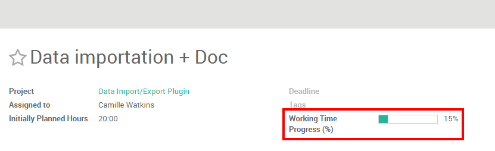
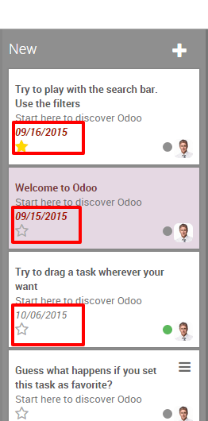

=============================================
How to plan and track employees' assignments?
=============================================

Following and planning your employees' assignments can be a heavy
challenge especially when you manage several people. Luckily, using Odoo
Project, you can handle it in only a couple of clicks.

Configuration
=============

The only necessary configuration is to install the **Project Management**
module. To do so, go in the application module, search for project and
install the application.

.. image:: media/assignments01.png
    :align: center

If you wish to manage time estimation, you will need to enable
timesheets on tasks. From the **Project** application, go to 
:menuselection:`Configuration --> Settings` in the dropdown menu. 
Then, under **Time Work Estimation**, select the **manage time 
estimation on tasks** option. Do not forget to apply your changes.

.. image:: media/assignments02.png
    :align: center

This feature will create a progress bar in the form view of your tasks.
Every time your salesperson will add working time in his timesheet, the
bar will be updated accordingly, based on the initially planned hours.

Manage tasks with views 
=======================

You can have an overview of your different task thanks to the multiple
views available with Odoo. Three main views will help you to plan and
follow up on your employees' tasks: the kanban view, the list view
(using timesheets) and the calendar view.

Create and edit tasks in order to fill up your pipeline. Don't forget to
fill in a responsible person and an estimated time if you have one.

Get an overview of activities with the kanban view
--------------------------------------------------

The Kanban view is a post-it like view, divided in different stages. It
enables you to have a clear view on the stages your tasks are in and the
ones having the higher priorities.

The Kanban view is the default view when accessing a project, but if you
are on another view, you can go back to it any time by clicking the
kanban view logo in the upper right corner

.. image:: media/assignments04.png
    :align: center

Add/rearrange stages
~~~~~~~~~~~~~~~~~~~~

You can easily personalize your project to suit your business needs by
creating new columns. From the Kanban view of your project, you can add
stages by clicking on **Add new column** (see image below). If you
want to rearrange the order of your stages, you can easily do so by
dragging and dropping the column you want to move to the desired
location. You can also fold or unfold your stages by using the **setting**
icon on your desired stage.

.. image:: media/assignments10.png
    :align: center

.. tip::
    Create one column per stage in your working process. For example, 
    in a development project, stages might be: Specifications, 
    Development, Test, Done.

Sort tasks by priority
~~~~~~~~~~~~~~~~~~~~~~

On each one of your columns, you have the ability to sort your tasks by
priority. Tasks with a higher priority will automatically be moved to
the top of the column. From the Kanban view, click on the star in the
bottom left of a task to tag it as **high priority**. For the tasks that
are not tagged, Odoo will automatically classify them according to their
deadlines.

Note that dates that passed their deadlines will appear in red( in the
list view too) so you can easily follow up the progression of different
tasks.

.. tip::
    Don't forget you can filter your tasks with the filter menu.

Track the progress of each task with the list view
--------------------------------------------------

If you enabled the **Manage Time Estimation on Tasks**, your employees
will be able to log their activities on tasks under the **Timesheets**
sub-menu along with their duration. The **Working Time Progress** bar will
be updated each time the employee will add an activity.

.. image:: media/assignments07.png
    :align: center

As a manager, you can easily overview the time spent on tasks for all
employees by using the list view. To do so, access the project of your
choice and click on the List view icon (see below). The last column will
show you the progression of each task.

.. image:: media/assignments08.png
    :align: center

Keep an eye on deadlines with the Calendar view
-----------------------------------------------

If you add a deadline in your task, they will appear in the calendar
view. As a manager, this view enables you to keep an eye on all
deadlines in a single window.

.. image:: media/assignments09.png
    :align: center

All the tasks are tagged with a color corresponding to the employee
assigned to them. You can easily filter the deadlines by employees by
ticking the related boxes on the right of the calendar view.

.. tip::
    You can easily change the deadline from the Calendar view by 
    dragging and dropping the task to another case.

.. seealso::
    * :doc:`../configuration/setup`
    * :doc:`forecast`