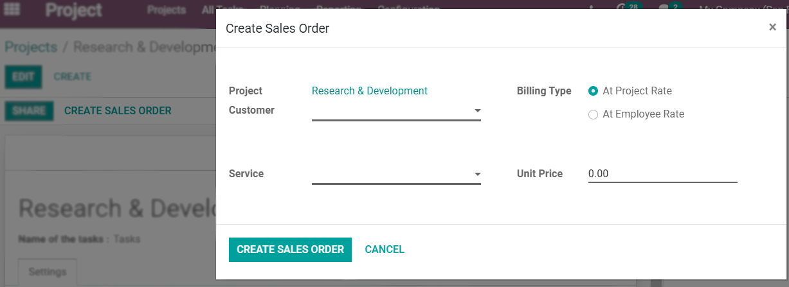
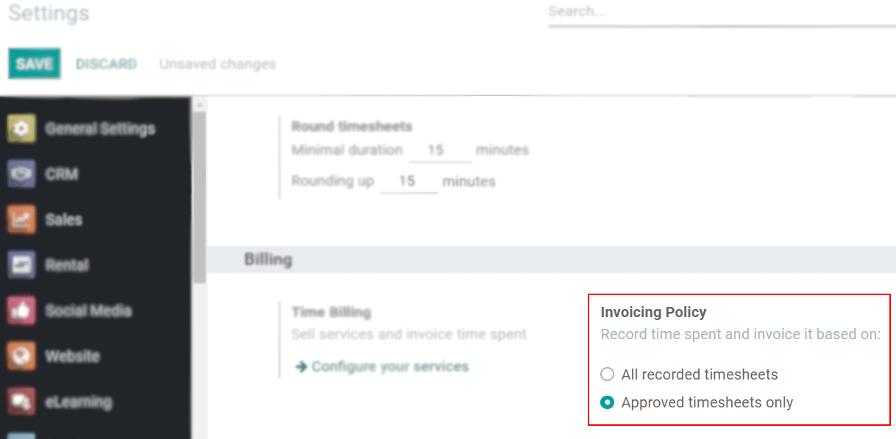

===========================
Invoice Time Spent on Tasks
===========================

When it is time to bill your client for their finished project/task, you can choose to shorten
processes and save time by pulling the billable time you have tracked into sales orders, and
invoices, directly from the project/task.

Enable the Timesheet feature
============================

Go to :menuselection:`Project --> Configuration --> Settings` and enable *Timesheets*.

Create a sales order and invoice from a task
============================================

| Under :menuselection:`Project --> Configuration --> Project`, choose the corresponding one and
  enable *Timesheet*, *Timesheet Timer* and *Bill from Tasks*.
| Once the time spent on a task under that project has been recorded, click on *Create Sales Order*
  and continue to create your invoice.

.. image:: media/sales_timesheet.png
   :align: center
   :alt: Have the sales order menu and the timesheet tab being shown under a task in Odoo Project

This way, you can invoice different customers, for different services, at different rates,
without the need to create numerous projects.

Create a sales order and invoice from a project
===============================================

| Under :menuselection:`Project --> Configuration --> Project`, choose the corresponding one and
  enable *Timesheet* plus *Timesheet Timer*.
| Now, go to :menuselection:`Project --> Configuration --> Projects`, choose the project,
  *Create Sales Order*, and continue to create your invoice.
| From here, choose if you want the billing to be based on the project rate: all timesheets are
  billed by the same rate, or by the employee rate: timesheets are billed by the individual
  rate of the employee.

| The project rate allows you to invoice a whole project, for a specific service, at a specific
  rate, at once. Example: the implementation of a system.
| The employee rate billing lets you invoice a project broken down into different services, and
  different rates. Example: different rates for junior and senior consultants.

Invoice only approved timesheets
================================

Go to :menuselection:`Timesheets --> Configuration --> Settings --> Invoicing Policy`, and choose
*Approved timesheets only*.

This ensures that the manager is aware of the hours being logged by each employee before the
customer gets invoiced.

.. seealso::
   - :doc:`../advanced/so_to_task`
   - :doc:`./time_record`

