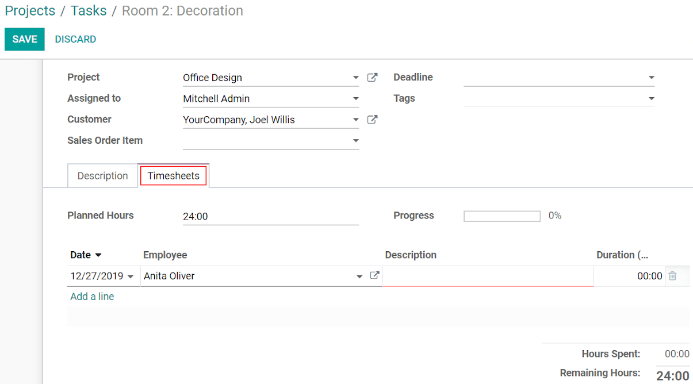
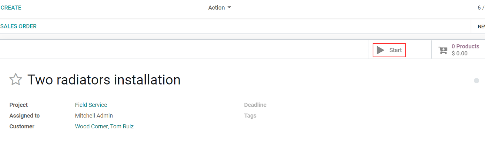

==========================
Record Time Spent on Tasks
==========================

Get to know how much time you are spending on tasks in order to make your employees’ life easier,
and records error-free. Launch the timer in your browser, stop it on your phone and have all entries
synced. Generate invoices based on the timesheet entries and be sure to invoice your customers
the exact right amount.

Manually timesheet on task
==========================

| Go to :menuselection:`Project --> Configuration --> Settings` and enable *Timesheets*. Then,
  enable the *Timesheets* option on the project.
| Now, once you are in your task, under the *Timesheet* tab, *Add a line* and specify the *Duration*.

Time tasks
==========

| Under :menuselection:`Project --> Configuration --> Projects`, enable *Timesheet timer* on the
  projects on which you need the functionality.
| Now, you can time your task clicking on *Start*. *Pause* at any moment, and *Stop* to confirm the
  recorded time and add a description.

