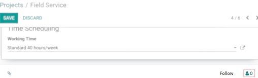
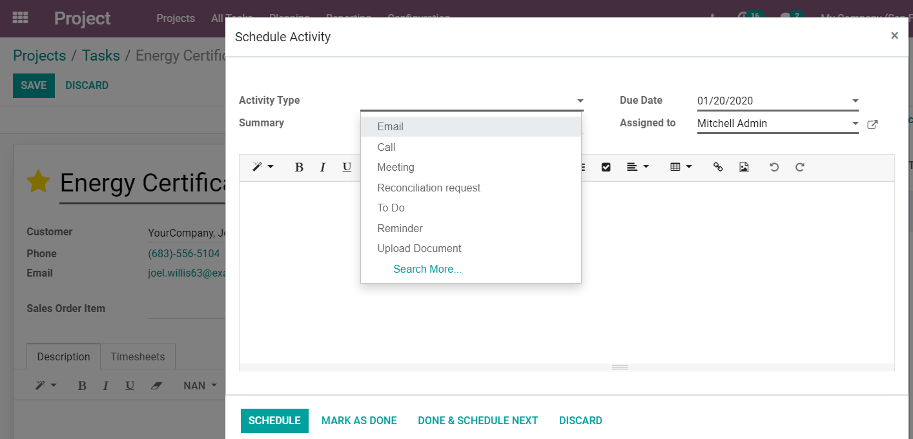

====================
Collaborate on Tasks
====================

Being able to collaborate virtually but with the same effect as if people were in the same room
increases your productivity. It results in faster execution of processes, brainstorming and decision
made easier while also allowing the support of outside contributions.

Add followers to a project
==========================

| *Edit* the project to add followers.
| Followers are notified of any changes: tasks sliding from one stage to another, conversations
  taking place, etc.

.. note::
   Following a project automatically makes you a follower of all its tasks.

Add followers to a task
=======================

Within a task, click on the *Followers* icon. Followers get notified of any changes in the task
and can see the task like you do, with the description and the chatter.

.. image:: media/follower_task.png
   :align: center
   :alt: Click on the follower icon to add followers to a task in Odoo Project

Select which notifications to get
---------------------------------

For a project or task, select what you would like to be notified about. For that, *Edit
subscription*.

.. image:: media/select_notif.png
   :align: center
   :alt: Click on the follower icon, then on edit subscription in Odoo Project

Use the pad like a collaborative note
=====================================

| Go to :menuselection:`Project --> Configuration --> Settings --> Collaborative Pads`, then edit
  the *Settings* of the project you would like the feature to work and enable *Use
  Collaborative Pads*.
| Now, you are able to contribute to tasks in real-time, with several users, with an Etherpad
  collaborative note. Every user has his own color and you can replay the whole creation
  of the content.

.. image:: media/pad_collaborative.png
   :align: center
   :alt: View of the collaborative pad in Odoo Project

.. tip::
   Click on the *</>* icon to get the direct URL of the task description: useful if you want to
   share it without adding this person as a follower, or to someone outside of the company.

The Chatter
===========

| *Chatter* is a communication tool that shows the history of a task, including changes and the
  interactions between you and your customers or colleagues.
| To interact with followers, whether there are internal or external, click on *Log a note* and ping
  them using the at symbol (*@*). If you want to send a message/email to all the followers in the
  task, use *Send a message*.
| You can also ping a channel using the hashtag sign (*#*). This way, users can have a channel per
  project team, for example.

.. image:: media/the_chatter.png
 	:align: center
	:alt: Overview of the chatter in Odoo Project

Schedule activities
-------------------

Do not forget promises made and stay organized by conveniently *Scheduling activities* from the
chatter.

Edit or create new activities types
-----------------------------------

Go to :menuselection:`Project --> Configuration --> Activity Types`.

.. image:: media/activity_type.png
 	:align: center
	:alt: Overview of the activity types form in Odoo Project