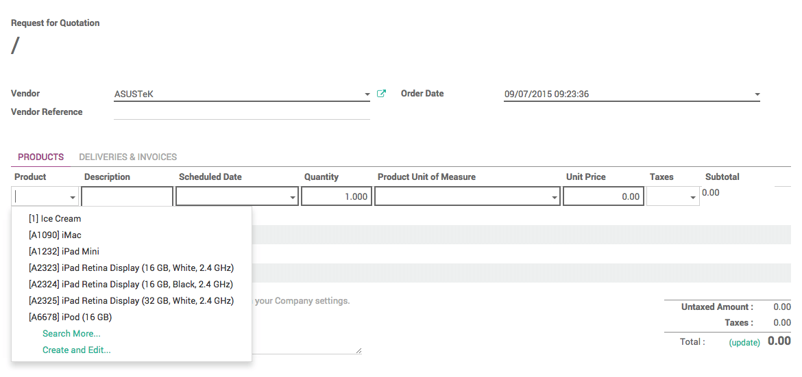

=============================================
From purchase order to invoice and receptions
=============================================

For most of your everyday purchases, chances are you already know where
to purchase and at what price. For these cases, a simple Purchase Order
(PO) will allow you to handle the whole process.

In Odoo, a purchase order can be created as is, but can also be the
result of a Request for Quotation or of a Purchase Tender. Therefore,
every purchase made in Odoo has a PO.

The PO will generate an invoice, and depending on the contract with your
supplier, you will be required to pay the invoice before or after
delivery.

Install the Purchase Management application
~~~~~~~~~~~~~~~~~~~~~~~~~~~~~~~~~~~~~~~~~~~

From the **Apps** application, search and install the 
**Purchase Management** application.

.. image:: media/from_po_to_invoice01.png
    :align: center

Creating a Purchase Order
~~~~~~~~~~~~~~~~~~~~~~~~~

In the **Purchases** app, open the **Purchase** menu and 
click on **Purchase Orders**.

In the **Purchase Orders** window, click on **Create**.

.. image:: media/from_po_to_invoice02.png
    :align: center

From the new window, insert the **Vendor** and type in the **Order
Date**.

In the **Products** section, click on **Add an item**.

Select your product from the list and add a description if necessary.

The **Scheduled Date** menu corresponds to the expected delivery date.

Type in the quantity which you wish to purchase, then click on **Save** and
on **Confirm Order**.

.. note::
    If you wish to go through the complete flow and create a **Request for 
    Quotation** for this order, refer to the document on 
    :doc:`../../purchases/rfq/create`

As you can see, the status of the PO has switched to ``Purchase Order``.

.. image:: media/from_po_to_invoice04.png
    :align: center

Registering invoice, payments and receiving products
~~~~~~~~~~~~~~~~~~~~~~~~~~~~~~~~~~~~~~~~~~~~~~~~~~~~

Depending on the contract you have with your supplier, you can either
pay for the purchase upon delivery of the goods, or get the goods
delivered after payment.

Payment upon or after reception
^^^^^^^^^^^^^^^^^^^^^^^^^^^^^^^

Still from your purchase order, click on **Receive Products**.

In the next page, check that the number of products received corresponds
to the number ordered, then manually enter the delivered quantity and
click on **Validate**.

.. image:: media/from_po_to_invoice05.png
    :align: center

Go back to the PO. In the PO, a **Shipment** and an **Invoice** button have
appeared.

.. image:: media/from_po_to_invoice06.png
    :align: center

Click on the **Invoices** button, then click on **Validate**. 
The invoice is now registered in the system. Click on **Register Payment**, 
insert the detail of the payment, and click on **Validate**.

.. image:: media/from_po_to_invoice07.png
    :align: center

Your products are now ready for picking and storage, and the invoice is
marked as paid.

Upfront payment
^^^^^^^^^^^^^^^

From the **Purchase Order** page, open the **Invoices** tab, then click on
**Create**.

In the next page, click on **Validate**. The invoice is now registered in
the system. Click on **Register Payment**, insert the detail of the payment,
and click on **Validate**.

.. image:: media/from_po_to_invoice08.png
    :align: center

Go back to the PO. In the PO, a **Shipment** tab and an **Invoice** tab have
appeared.

.. image:: media/from_po_to_invoice09.png
    :align: center

Click on **Receive Products**, then in the new page, click on **Validate**.

.. image:: media/from_po_to_invoice10.png
    :align: center

A window will appear, asking if you wish to process every item at once.
Click on **Apply**.

Your products are now ready for picking and storage, and the invoice is
marked as paid.

