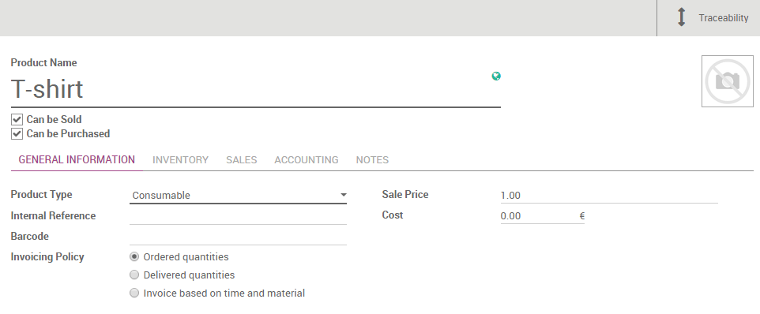
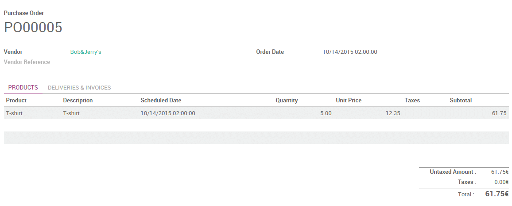
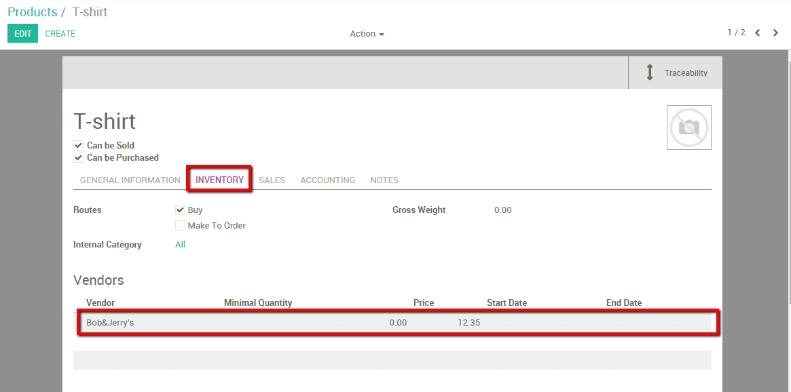
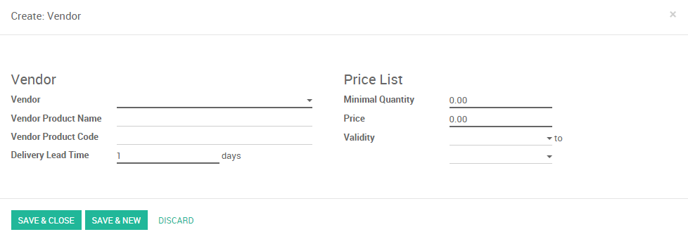

==========================================
How to set several suppliers on a product?
==========================================

Keeping track of your vendors can be a real burden in day-to-day
business life. Prices can change and you might have several suppliers
for one product. With Odoo you have the possibility to directly link
vendors with the corresponding product and specify prices automatically
the first time you purchase them.

We will take the following example: We need to buy ``5 t-shirts``. We found
a **Vendor**; called ``Bob&Jerry's`` and we want to issue a request for
quotation.

Configuration 
==============

Install the purchase module
---------------------------

The first step to set your suppliers on your products is to install the
purchase module. Go into your **App** module and install the
**Purchase** module.

.. image:: media/suppliers01.png
    :align: center

.. note::
    By installing the purchase module, the inventory and invoicing module 
    will be installed as well.

Create a Vendor
---------------

The second step is to create a vendor. In this case we'll create the
vendor ``Bob&Jerry's``. Enter the purchase module, select 
:menuselection:`Purchase --> Vendors` and create a new vendor.

You can choose if the contact is a company or a person, fill in basic
information such as address, phone, email,...

If you did not create the contact from the purchase module you will need
to go in the **Sales and Purchases** tab as well and indicate that the
contact is a **Vendor** (see picture below). If the contact is created from
the purchase module this box will be ticked automatically.

.. image:: media/suppliers02.png
    :align: center

Create a product
----------------

Next we can create the product we want to buy. We don't know the price
of the t-shirt yet because we still need to issue our **Request for
Quotation**.

To create a product enter your purchase module select 
:menuselection:`Purchase --> Products` and create a new product.

We will call our product ``T-shirt`` and specify that the product can be
sold and purchased.

Add Vendors to the product
--------------------------

The next action is to add vendors to the product. There are two ways to
handle this. If you issue a purchase order for the first time Odoo will
automatically link the vendor and its price to the product. You can also
add vendors manually

By issuing a first Purchase Order to new vendor
~~~~~~~~~~~~~~~~~~~~~~~~~~~~~~~~~~~~~~~~~~~~~~~

When issuing a purchase order for the first time to a vendor, he will
automatically be linked to the product by Odoo. For our example let's
say that we issue a first purchase order to ``Bob&Jerry's`` for ``5 t-shirts`` 
at ``12.35 euros / piece``.

First create your purchase order with the correct product and 
supplier (see picture below, or the documentation page 
:doc:`../rfq/create` for more information)

When we save and validate the purchase order the vendor will
automatically be added to the product's vendors list. To check this
enter the purchase module, select :menuselection:`Purchase --> Products` and 
select our T-shirt product. By opening the **Inventory** tab we notice that our
vendor and its price has automatically been added.

Note that every first time the product is purchased from a new
vendor, Odoo will automatically link the contact and price with the
product.

By adding manually
~~~~~~~~~~~~~~~~~~

We can of course also add vendors and vendors information manually. On
the same page than previously, simply click on **Edit** and click the **Add
an item** button.

.. image:: media/suppliers06.png
    :align: center

When adding a new **Vendor** you are also able to add extra information such
as the vendor product name or code, the validity of the price and the eventual
minimum quantity required. These informations can be added and modified
for existing vendors by simply clicking on the vendors line.

