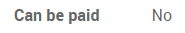
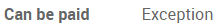
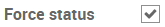

=================================================================
How to determine if a vendor bill should be paid (3-way matching)
=================================================================

In some industries, you may receive a bill from a vendor before
receiving the ordered products. However, the bill should maybe not be
paid until the products have actually been received.

To define whether the vendor bill should be paid or not, you can use
what is called the **3-way matching**. It refers to the comparison of
the information appearing on the Purchase Order, the Vendor Bill and the
Receipt.

The 3-way matching helps you to avoid paying incorrect or fraudulent
vendor bills.

Configuration
-------------

Go in :menuselection:`Purchase --> Configuration --> Settings`
and activate the 3-way matching.

.. image:: media/3_way_matching01.png
   :align: center
   :width: 6.50000in
   :height: 0.70833in

Should I pay this vendor bill?
------------------------------

Once this setting has been activated, a new information appears on the
vendor bill, defining whether the bill should be paid or not. There are
three possible values:

*Use case 1*: I have received the ordered products.

.. image:: media/3_way_matching02.png
   :align: center
   :width: 2.26042in
   :height: 0.28125in

*Use case 2*: I have not received the ordered products.

*Use case 3*: the quantities do not match across the Purchase Order,
Vendor Bill and Receipt.

.. tip::
   The status is defined automatically by Odoo. However, if you want
   to define this status manually, you can tick the box *Force Status* and
   then you will be able to set manually whether the vendor bill should be
   paid or not.

