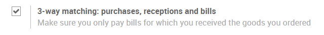
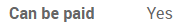

=======================================================
Determine when to pay a vendor bill with 3-way matching
=======================================================

In some industries, you may receive a bill from a vendor before
receiving the ordered products. However, you might not want to pay it
until the products have been received.

To define whether the vendor bill should be paid or not, you can use
what we call *3-way matching*. It refers to the comparaison of the
information appearing on the *Purchase Order*, the *Vendor Bill*
and the *Receipt*.

The 3-way matching helps you avoid paying incorrect or fraudulent
vendor bills.

Configuration
=============

For this feature to work, go to :menuselection:`Purchases -->
Configuration --> Settings` and activate the *3-way matching* feature

Should I pay the vendor bill?
=============================

With the feature activated you will have a new *Should be paid* line
appear on the vendor bill under the *Other info* tab.

That way Odoo let's you easily know if you should pay the vendor bill or
not.

.. tip::
   The status is defined automatically by Odoo. However, if you want to
   define this status manually, you can tick the box Force Status and then
   you will be able to set manually whether the vendor bill should be paid
   or not.
