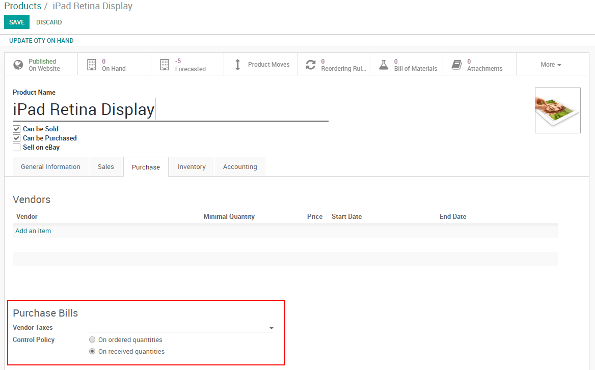
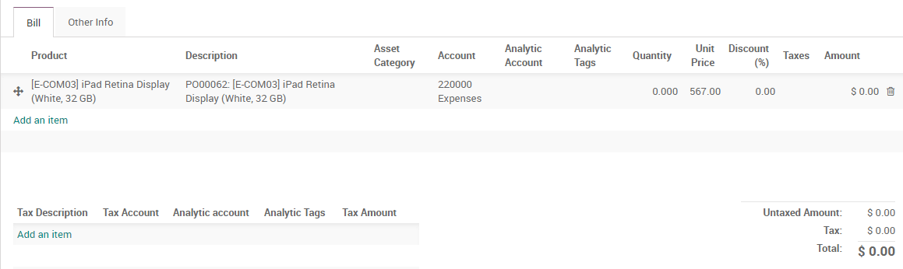

============
Bill Control
============

With Odoo, you can define a setting to help the control of your bills.
*Bill Control* lets you choose if the supplier sends you the bill
before or after you receive the goods.

Configuration
=============

For this feature to work, go to :menuselection:`Purchases -->
Configuration --> Settings` and select which way you want to control your
bills.

.. image:: media/bills01.png
    :align: center

Change the control policy
=========================

While the setting above will be your default method of bill control, you
can always select which way you want to invoice your product on each
product page under the *Purchase* tab.

You might want to use different settings for different types of
products.

Verify your Vendor Bill
=======================

If you didn’t receive any of your product yet on *Purchase Order*
under the *Shipment* tab,

.. image:: media/bills03.png
    :align: center

Depending on the billing policy defined above. If you're supposed to be
billed based on ordered quantity, Odoo will suggest a bill for the
number of units ordered. If you're supposed to be billed based on the
received quantities, Odoo will suggest a bill for 0 as shown above.

