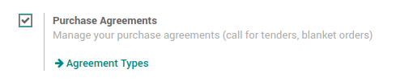
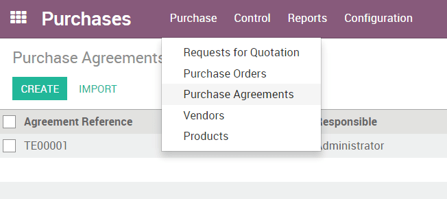

==============================
How to manage Purchase Tenders
==============================

A **Purchase Tender** (PT), also known as Call for Bids, is used to
drive competition between several suppliers in order to get the best
offer for a list of products. In comparison to the RfQ, a Purchase
Tender is sent to multiple suppliers, stating each are competing with
one another, and that the best offer will win. The main interest is that
it usually leads to better offers.

For more information on best uses, please read the chapter `Request for
Quotation, Purchase Tender or Purchase
Order? <https://www.odoo.com/documentation/user/11.0/purchase/overview/process/difference.html>`__

Activate the Purchase Tender function
-------------------------------------

By default, the Purchase Tender is not activated. To be able to use PTs,
you must first activate the option.

In the Purchases module, open the Configuration menu and click on
Settings. In the Purchase Order section, locate the **Calls for
Tenders** and tick the box Allow using call for tenders... (advanced),
then click on **Apply**.

Create a Purchase Tender
------------------------

To create a new Purchase Tender, open :menuselection:`Purchase --> Purchase Agreements
(PA)`.

In the Purchase Agreements window, click on **Create**. A new Purchase
Agreement window opens.

In the **Agreement Type** field, choose Purchase Tender.

The **Agreement Deadline** field tells the vendors when to have their offers submitted.

The **Ordering Date** field tells the vendors when we will submit a purchase order to the chosen vendor.

The **Delivery Date** field tells the vendors when the product will have to be delivered.

You do not have to define a **Vendor**.

In the **Products** section, click on **Add an item**. Select products
in the Product list, then insert **Quantity**. You can add as many
products as you wish.

.. image:: media/manage_multiple_offers02.png
	:align: center

Click on **Confirm Call**.

Now click on the button **New Quotation**. A RfQ is created with the
products chosen on the PT. Choose a **Vendor** and send the RfQ to the
vendor. Repeat this operation for each vendor.

.. image:: media/manage_multiple_offers03.png
	:align: center

Once all the RfQs are sent, you can click on **Validate** on the PT.

The vendors will send their offers, you can update the RfQs accordingly.
Then, choose the ones you want to accept by clicking on **Confirm
Order** on the RfQs and **Cancel** the others.

You can now click on **Done** on the PT.

View `Purchase Tenders <https://demo.odoo.com/?module=purchase_requisition.action_purchase_requisition>`__
in our Online Demonstration.

.. seealso:: 

	:doc:`../../overview/process/from_po_to_invoice`

	:doc:`../../overview/process/difference`
