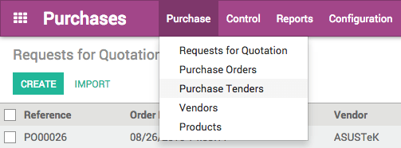
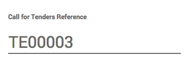
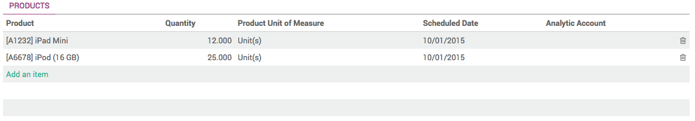
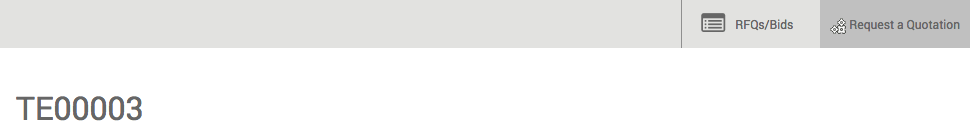
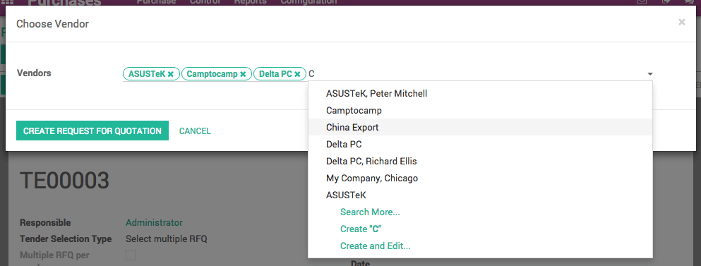
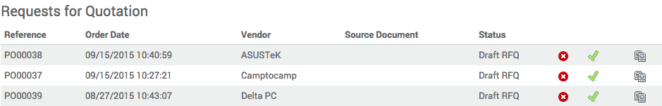

===================================================================
How to manage multiple offers from suppliers with purchase tenders?
===================================================================

A **Purchase Tender** (PT), also known as Call for Bids, is used to
drive competition between several suppliers in order to get the best
offer for a list of products. In comparison to the RfQ, a Purchase
Tender is sent to multiple suppliers, stating each are competing with
one another, and that the best offer will win. The main interest is that
it usually leads to better offers.

For more information on best uses, please read the chapter :doc:`../../overview/difference`

Configuration
=============

Activating the Purchase Tender function
---------------------------------------

By default, the Purchase Tender is not activated. To be able to use PTs,
you must first activate the option.

In the Purchases module, open the Configuration menu and click on
Settings. In the Purchase Order section, locate the **Calls for
Tenders** and tick the box Allow using call for tenders… (advanced),
then click on **Apply**.

.. image:: ./media/image16.png
	:align: center

Creating a Purchase Tender
--------------------------

To create a new Purchase Tender, open :menuselection:`Purchase --> Purchase Tenders`.

In the Purchase Tenders window, click on **Create**. A new Purchase Tenders
window opens.

By default, Odoo names PTs "TEXXXXX" but you can change it as you like.

In the **Responsible** field, you can select the person who will be in
charge of the PT.

In the **Tender Selection Type** menu, you can decide to:

- select only one RfQ and automatically cancel all other bid: *Select only one RFQ (exclusive)*

- allow multiple purchase orders for this PT: *Select multiple RFQ*

Tick in the box **Multiple RFQ per vendor** if you wish to allow
suppliers to send in more than one Request for Quotation.

.. image:: ./media/image18.png
	:align: center

In the **Tender Closing Deadline** field, select the date to bids are
closed for suppliers.

In the **Scheduled Ordering Date** field, select the date to which you
will place the order.

In the **Scheduled Date** field, select the date to which the products
should be delivered.

In the **Source Document** field, you can insert a previous PO to use as
a template.

.. image:: ./media/image15.png
	:align: center

In the Products section, click on **Add an item**.

Select the product in the **Product** list, then insert **Quantity**.
You can add as many products as you wish.

Click on **Save**, then on **Confirm Call**. Two new RFQs/Bids and Request a
Quotation tabs have appeared on the right side of the window.

Click on **Request a Quotation** and type in the names of the suppliers you
wish to include in the PT, then click on **Create Request for Quotation**.

A list of suppliers has appeared in the **Requests for Quotation**
section.

To send the RfQs to your suppliers, click on the green V icon. You can
also review the RfQ before sending them by clicking on them.

When you receive offers, click on the RFQs/Bids tab. In the list view,
select the company and click on **Edit** to adapt the details as stated in
the offer.

.. image:: ./media/image20.png
	:align: center

When you have edited all the corresponding fields, click on **Save**.

When the deadline has been reached, click on **Close Call for Tenders**. The
status of the PT is now **Bid Selection**. Open the RFQs/Bids tab and open
the RfQ(s) you wish to proceed with.

.. image:: ./media/image14.png
	:align: center

Click on **Approve Order** to convert the RfQ into a Purchase Order, the go
back to your PT and click on **Done** to close the PT.

.. demo:action:: purchase_requisition.action_purchase_requisition

   View *Purchase Tenders* in our Online Demonstration

.. seealso:: 

	:doc:`../../overview/from_po_to_invoice`

	:doc:`../../overview/difference`
