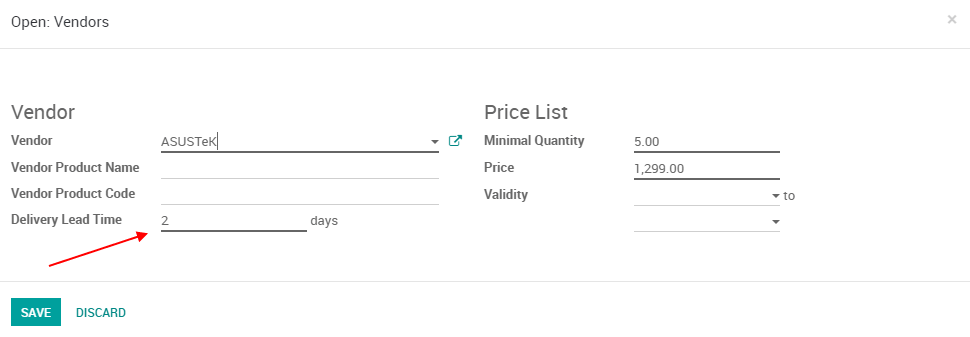
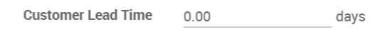
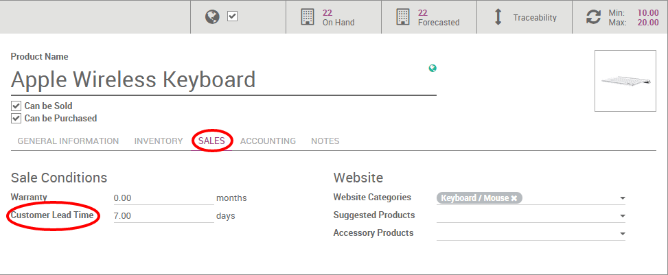
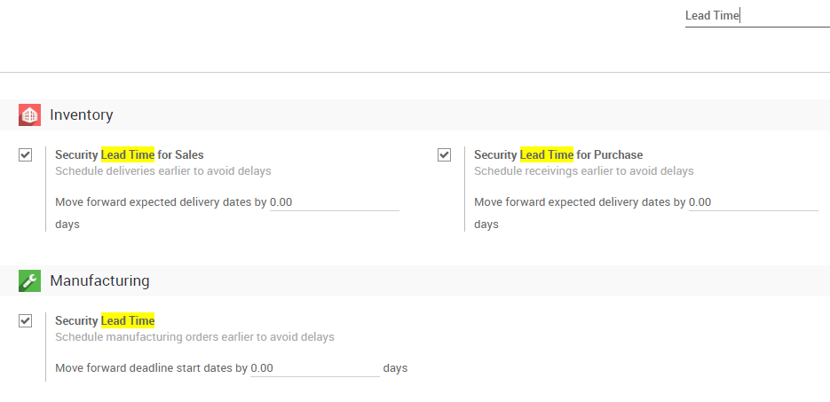

=====================================
Schedule your receipts and deliveries
=====================================

To manage your supply chain scheduling, you will need to use Odoo *Lead
Times*.

*Lead Times* are the expected times needed to receive, deliver or
manufacture products.

Configure Lead Times
====================

Vendor Lead Time
----------------

The vendor lead time is the time needed by your vendor to deliver the
product to you.

To configure your vendor lead times, go to a product page, under the
purchase tab, click on a *Vendor* once there you can change the
delivery lead time for that Vendor & Product.

Customer Lead Time
------------------

The customer lead time, on the other hand, is the time you need to
deliver the product to your customer.

To configure your customer lead time open a product and go under the
*Inventory* tab. You can then add how many days you need.

Manufacturing lead time
-----------------------

The manufacturing lead time is the time you need to manufacture the
product.

To configure your manufacturing lead time open a product and go under
the *Inventory* tab. You can then add how many days you need.

Configure Security Lead Times
=============================

Odoo also lets you configure *Security Days* allowing you to cope with
potential delays along the supply chain and make sure you meet your
engagements.

The easiest way is to go to *Settings* from any module and type
**Lead Time** in the search bar. From there, tick each box and
configure your various *Security Lead Time* for your needs.

Alternatively, you can go in the settings of the *Inventory* module
and *Manufacturing* module to configure those settings.

Lead & security times in a use case
===================================

For example you sell a car today (January 1st), that is purchased on
order, and you promise to deliver your customer within 20 days (January
20). Here is your product’s configuration:

- Security lead time for sales : 1 day

- Security lead time for purchase : 1 day

- Vendor delivery lead time : 9 days

In such a scenario, the scheduler will trigger the following events
based on your configuration.

- January 19: scheduled delivery date (20th January - 1 day of security
  lead time for Sales)

- January 18: scheduled receipt date (19th January - 1 day of security
  lead time for Purchase)

- January 10: order date = deadline to order from your vendor (19th
  January - 9 days of vendor lead time)
