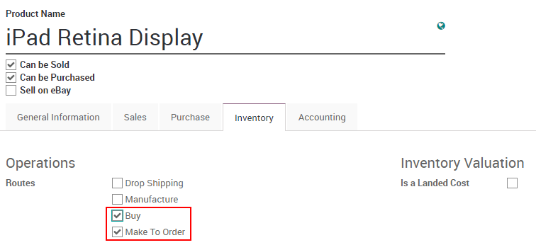
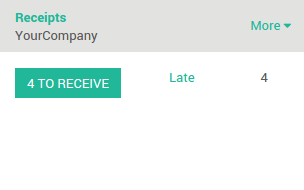

=======================================================
How to trigger the purchase of products based on sales?
=======================================================

Overview
========

When you work in just-in-time, you don't manage stock so you directly
order the product you need from your vendor.

The usual flow is:

1. Create a sale order

2. Purchase the product

3. Receive and pay the bill

4. Deliver your product

5. Invoice your customer

Product configuration
=====================

In the purchases application, open the **Purchase** menu and click on
**Products**. Open the product on which you want to do your purchases based
on sales.

Next to Routes, tick **Buy** and **Make to order** as a procurement method.
When you are generating sales order, Odoo will automatically reorder the
same quantity through procurement.

Don't forget to set a vendor otherwise the rule won't be triggered.

You can also configure minimum stock rules that will trigger the
purchase orders.

.. note::
    To know how to configure a minimum stock rule, please read the document 
    :doc:`setup_stock_rule`.

Process
=======

Sale order
----------

To create a sale order, go to the **Sales** application, 
:menuselection:`Sales --> Sales order` and create a new sale order.

.. image:: media/purchase_triggering02.png
    :align: center

After confirming it, you will see one **Delivery** associated with this
sale order on the **button** on the top of it.

.. image:: media/purchase_triggering03.png
    :align: center

Click on the **Delivery** button to see the transfer order. The status
of the outgoing shipment is **Waiting Another Operation**. It won't be done
until the purchase order is confirmed and received.

Purchase order
--------------

The purchase order is automatically created. Go to the **Purchase**
application :menuselection:`Purchase --> Request for Quotation`. 
The source document is the sale order that triggered the procurement.

.. image:: media/purchase_triggering04.png
    :align: center

.. note::
    If you make some more sales that trigger procurements to the same
    vendor, it will be added to the existing request for quotation. Once it
    is confirmed, the next procurements will create a new request for
    quotation.

Receipt and delivery
--------------------

Go the the **Inventory** application. Click on **# To Receive** on the
**Receipts** tile.

Select the receipt from your vendor and **Validate** it.

.. image:: media/purchase_triggering06.png
    :align: center

Go back to the **Inventory** dashboard. In the delivery order, click on **#
To Do**. The delivery order is now ready to ship.

.. image:: media/purchase_triggering07.png
    :align: center

The status of the delivery changed from **Waiting Availability** to
**Available**. Validate the transfer to confirm the delivery.

.. image:: media/purchase_triggering08.png
    :align: center

.. seealso::
    * :doc:`setup_stock_rule`
    * :doc:`warning_triggering`