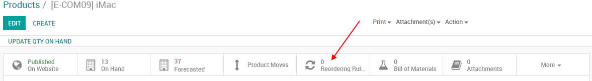

=================================================
Don’t run out of stock thanks to Reordering Rules
=================================================

To make sure you never run out of stock, you might want to define
*Reordering Rules* on products. Thanks to reordering rules, Odoo will
help you to replenish your stock when it reaches a minimum stock level.

Set a reordering rule
=====================

Open a stockable product, you'll find the *Reordering Rules* tab.

.. note::
  You can also access all your reordering rules from
  :menuselection:`Inventory --> Master Data --> Reordering Rules`.

Once in the next menu, you can create the reordering rules linked to
your product. From now on, every time this product reaches the minimum
quantity it will replenish your stock to your **maximum quantity**.

.. image:: media/setup_stock_rule02.png
  :align: center

.. tip::
  The replenishments will take place when the scheduler in the
  *Inventory* module runs. By default in Odoo, the schedulers will run
  every night at 12:00PM.

  See also: :doc:`../../../inventory/management/misc/schedulers`

From now on, every time a product with a reordering rule reaches the
minimum stock, the system will automatically see how to fulfill that
need based on the product configuration (e.g create an RfQ, create an
MO, etc.).

Troubleshooting
===============

For your reordering rules to work, your product needs to be correctly
configured. If you are using *Buy* route, you need a vendor on the
product. If you are using *Manufacturing* route you will been a BoM
on the product. If the product is not fully configured or there is a
mistake in your routes, a next activity will be logged on the product
informing you there is an issue with the configuration.

.. image:: media/setup_stock_rule03.png
  :align: center
