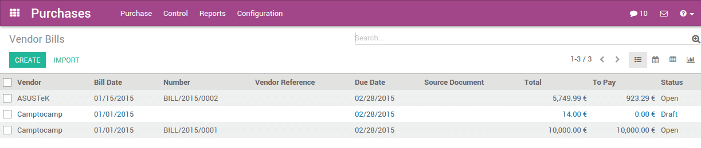

=============================================
How to check that everything is working fine?
=============================================

Vendor Bills
============

Even if you don't have the rights to the accounting application, you can
still control the vendor bills.

Go to the **Purchases** application: :menuselection:`Control --> Vendor Bills`.

Incoming Products
=================

Even if you don't have the rights to the inventory application, you can
still control the incoming products.

Go to the **Purchases** application: :menuselection:`Control --> Incoming Products`.

.. image:: media/is_everything_ok02.png
    :align: center

Procurements exceptions
=======================

Here, you need the **Inventory Manager** access rights.

Go to the **Inventory** application: :menuselection:`Control --> Procurement Exceptions`.

.. image:: media/is_everything_ok03.png
    :align: center

To understand why the procurement is not running, open the exception and
check the message in the chatter.

.. image:: media/is_everything_ok04.png
    :align: center

Usually, the problem is located on the procurement rules. Either there
are no stock rules, or there are no vendor associated to a product.
