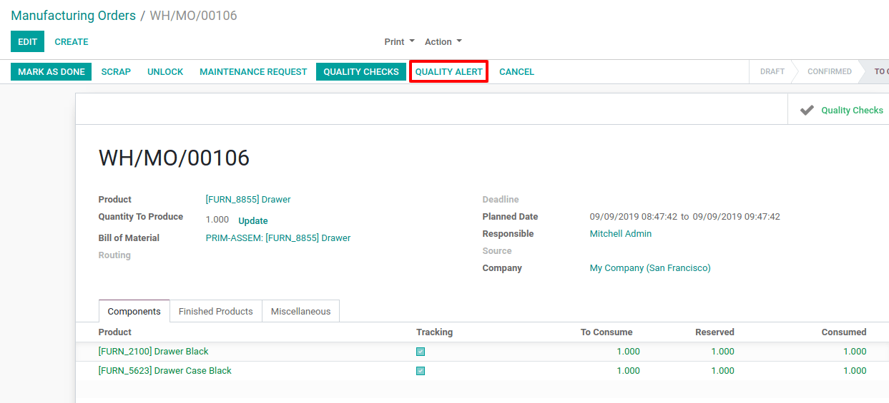
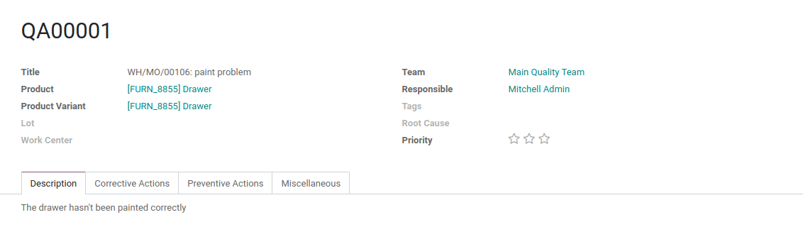
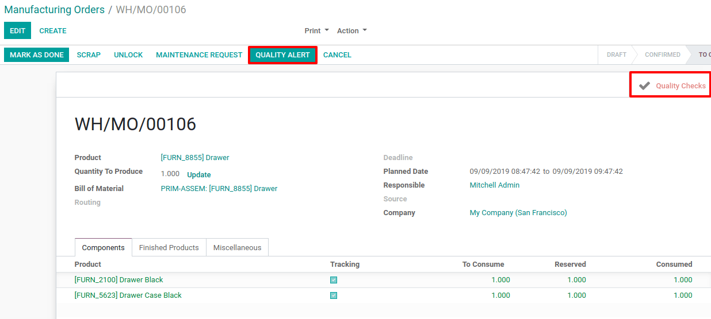
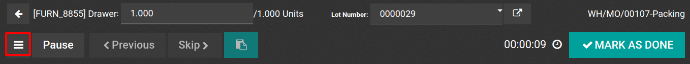
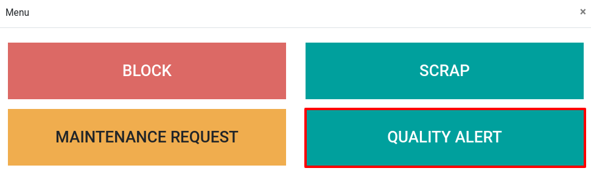
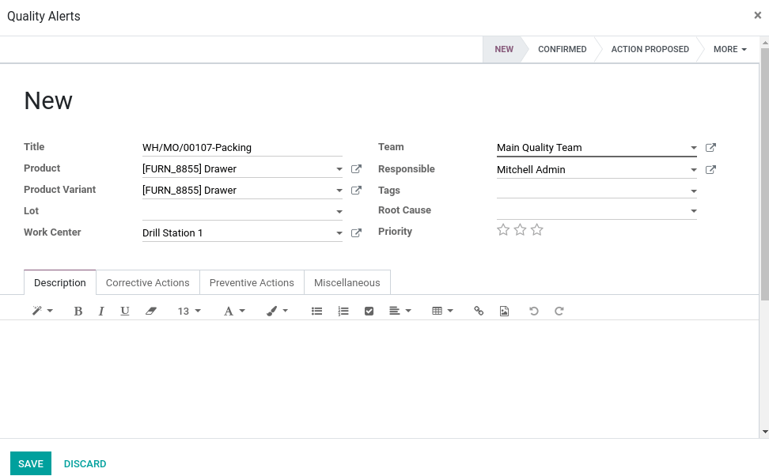

===================================================
Generate a Quality Alert from a Manufacturing Order
===================================================

Speaking of manufacturing orders, you have two different situations to
consider in Odoo. Those two will result in two different processes:

-  You work with a simple manufacturing flow;

-  You work with a complex manufacturing flow that includes routings.

Simple manufacturing flow
=========================

If you work with simple manufacturing orders, the *Quality Alerts*
will be launched from the manufacturing order itself. When manufacturing
a product for which you need to process quality controls, a button
*Quality Alert* will appear on the top of your manufacturing order.

By clicking on the button, you can specify the quality problem that
arose during the process.

If one of the quality checks failed, the button will be highlighted on
the document. If not, the button won’t be highlighted.

Manufacturing Flow with Routings
================================

If you work with routings defined on your manufacturing orders, the
quality alerts will be launched directly from the work orders on which
the quality checks took place.

Then, a button *Quality Alert* will be available from the work order
view. When you click on the button, you can specify the quality problem
that appeared during the process.

