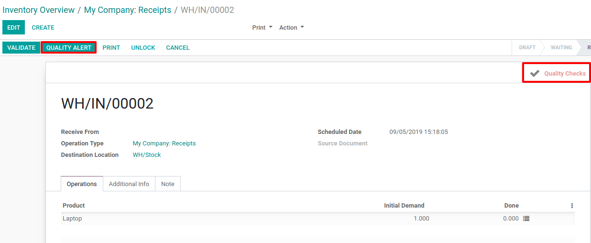
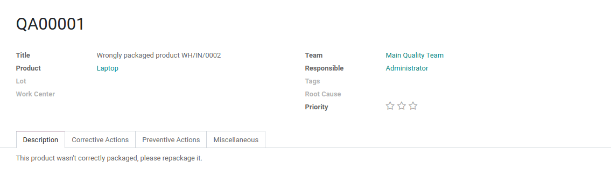
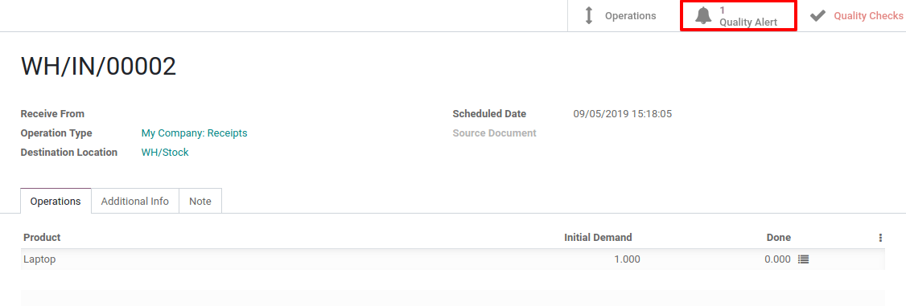
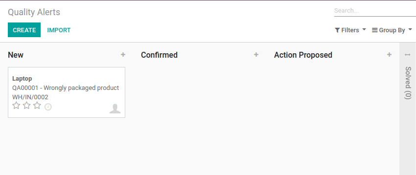

========================================
Generate a Quality Alert from a Transfer
========================================

Use the Quality Alert
=====================

Every time you perform some *Quality Checks* on a transfer, a
*Quality Alert* button appears. You can always use it. The button is
automatically highlighted once you have a failed quality check for the
transfer.

If you click on that *Quality Alert* button, you can specify what was
the problem with the product.

The *Quality Alert* that is created from the transfer can be found via
the button appearing on the top right corner of the transfer.

You can also access all your *Quality Alerts* via the menu, accessible
under *Control*.

