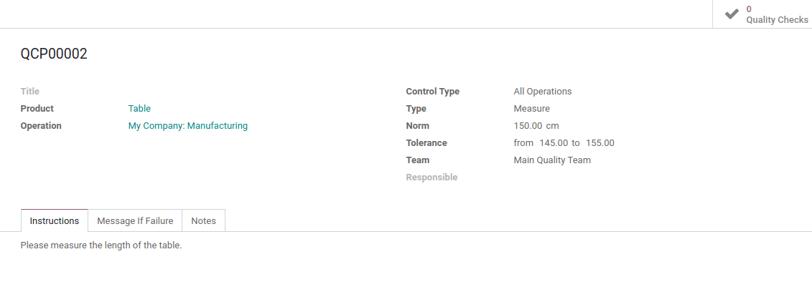
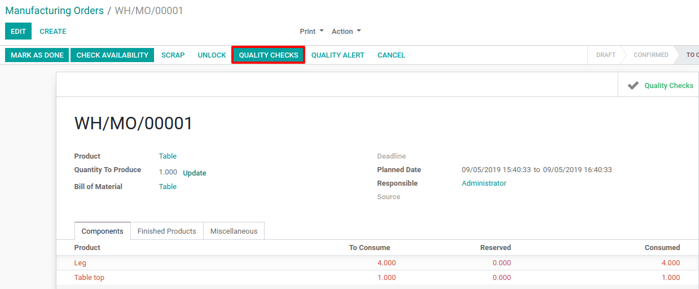
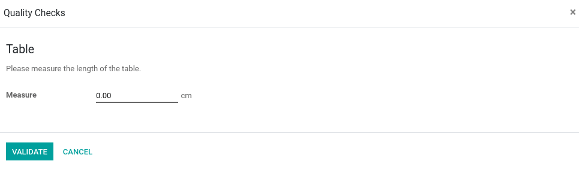
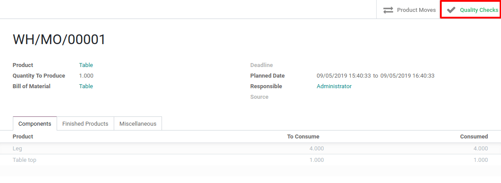
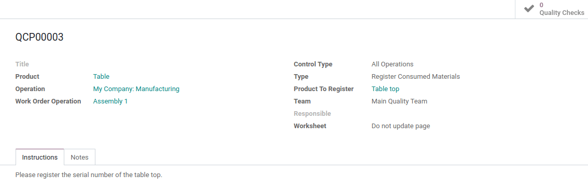
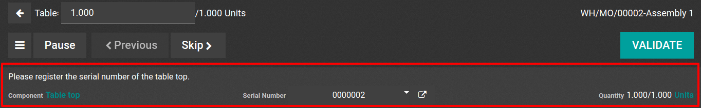

==============================================
Perform Quality Checks on Manufacturing Orders
==============================================

There are two different situations to consider and that will differ in
Odoo processes:

-  You work with simple manufacturing flows;

-  You work with complex manufacturing flows that are represented by the use of routings in Odoo.

Simple Manufacturing Flow
=========================

Create the Quality Control Point
--------------------------------

To create a quality control point, open the quality app and go to
*Control > Control Points*. There, hit create. Make sure to select
*Manufacturing* as operation and choose the type of quality check you
want to perform.

Process the Quality Check
-------------------------

Once your *Quality Control Point* has been created, you can create a
manufacturing order for your product. Now, and before marking the
manufacturing as done, you can register the *Quality Checks*.

Once you have performed your quality checks, you can find them via the
*Quality Checks* button available on the manufacturing order form.

.. note::
         If you want to access all your quality checks, you can do this by
         opening the quality checks menu, under quality control.

Manufacturing Flow with Routings
================================

Create the Quality Control Point
--------------------------------

If you want to create a *Quality Control Point*, open the *Quality*
app and go to *Control > Control Points*. Then, click on create. Make
sure to select *Manufacturing* as operation and select the work order
operation on which the quality check should be performed.

.. note::
         Choosing the work order operation is necessary if you want the quality
         checks to be performed in the work orders. After that, you can choose
         the type of quality check.

Process the Quality Check
-------------------------

Once your *Quality Control Point* has been configured, create a
manufacturing order for your product. You have to plan it if you want to
generate the necessary work orders.

.. image:: media/quality_mo_06.png
   :align: center

Now, process the work order and your quality check will appear. In this
example, the quality check requests to enter the serial number of the
Table Top component.

