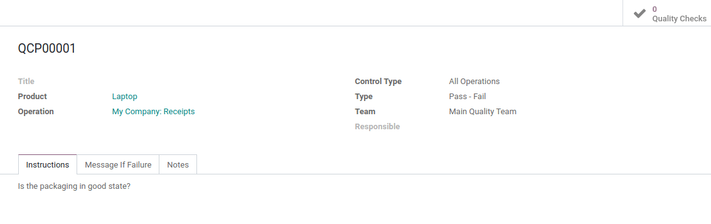
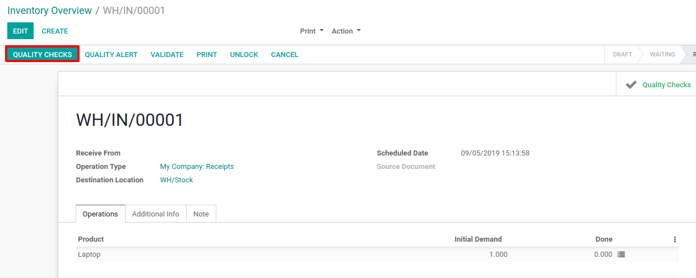
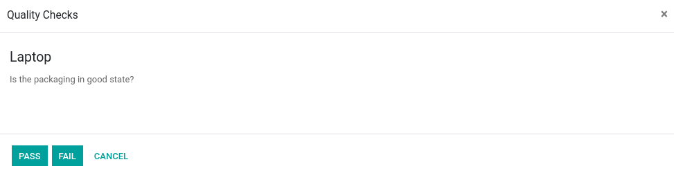
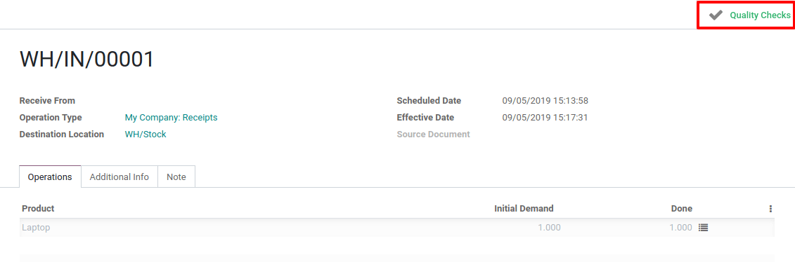
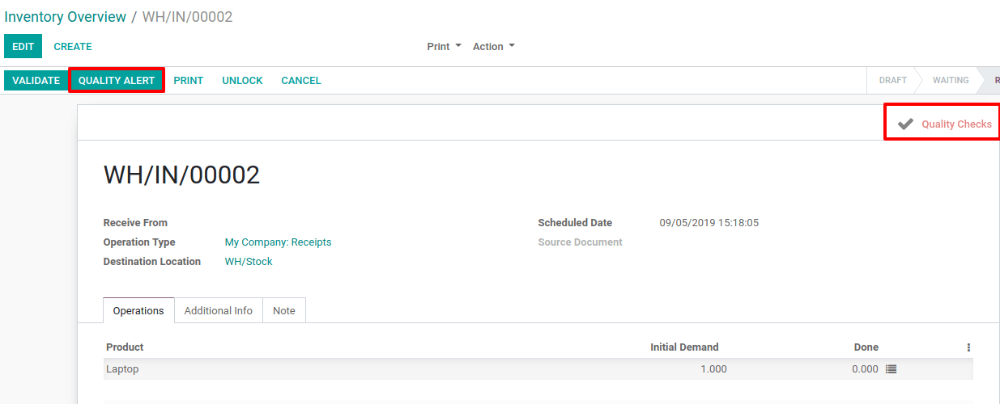
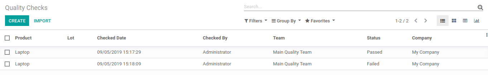

===================================
Perform Quality Checks on Transfers
===================================

Create the Quality Control Point
================================

To create a *Quality Control Point*, open the *Quality* application.
Then, go to :menuselection:`Quality Control --> Control Points --> Create`. Now, you can
define the quality control point you want to apply to a specific
product. Don’t forget to select a transfer operation type.

Process the Quality Check
=========================

Let’s say that we will receive a laptop. First, create a planned receipt
for the product. Then, on the receipt, you will see a *Quality Checks*
button that appears to proceed to the quality check you configured
before.

By clicking on it, the instruction set on the quality control point will
be displayed and will require the check value.

Once the quality check is done, you can find it linked to the
corresponding transfer and access it by clicking on the button.

But, if the quality check failed, the stat button will appear in red
(instead of green) and Odoo will suggest you to create a *Quality
Alert* by highlighting the corresponding button.

The quality checks can also be found in the *Quality* application by
opening the *Quality Checks* menu, under *Quality Control*.

