=============================
Define Quality Control Points
=============================

Quality Control Points
======================

If it is the first *Quality Control Point* that you create, know that
you need to open the *Quality* app. Then, go to *Quality Control >
Control Points*. Once there, you have to define the product on which
the quality control will take place, as well as the operation at which
it should take place.

The *Quality Control Points* can take place during transfers or during
the manufacturing process of the products. If you work with routings on
your *Bill of Materials*, you have to precise at which step of the
manufacturing process the quality control point should be applied.

The control type defines at which frequency the quality checks should
take place:

-  All Operations: all the operations will generate quality checks to perform;

-  Randomly: the quality checks will only be performed on x% of the operation. You must define the percentage yourself, on the control point;

-  Periodically: the quality checks will be performed periodically. The periodicity is based on the period you define (once a day, once a week).

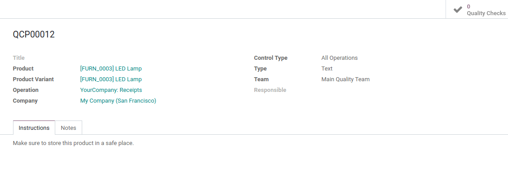

Quality Control Point Types
===========================

Now that the rest is configured, you need to define the type of quality
check.

.. note::
        Some of the types are only available with the manufacturing application.

Text
----

This control point type allows you to give instructions to your workers
during the transfer, or the manufacturing process.

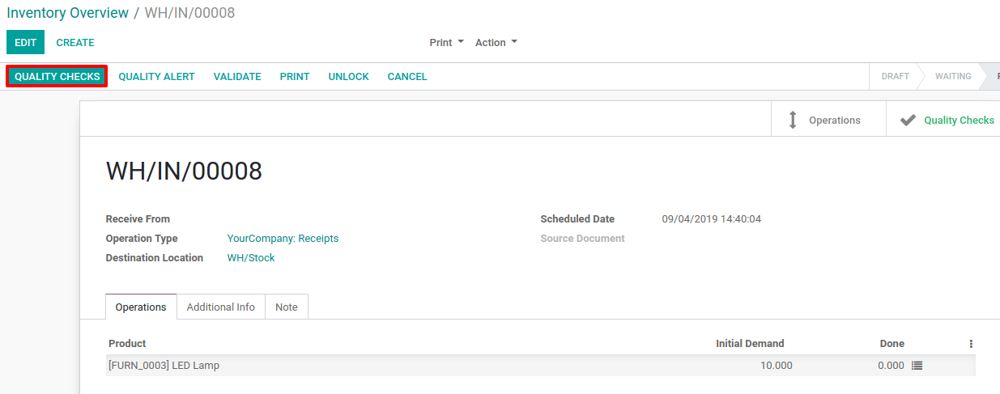

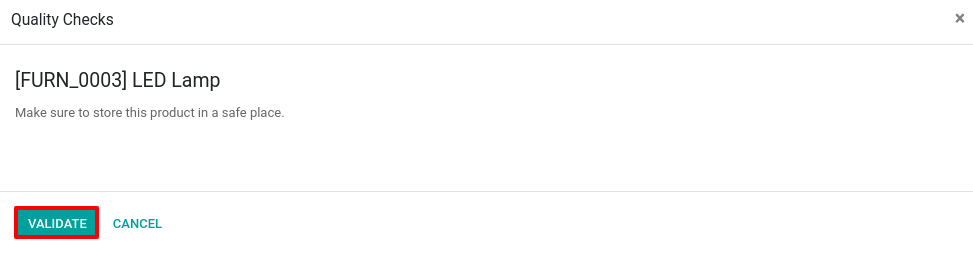

Take a Picture
--------------

This control point type asks you to take a picture of the product in a
transfer, or when manufacturing it.

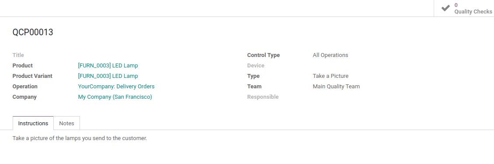

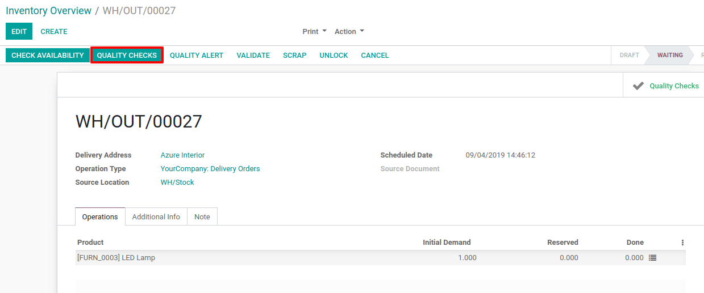

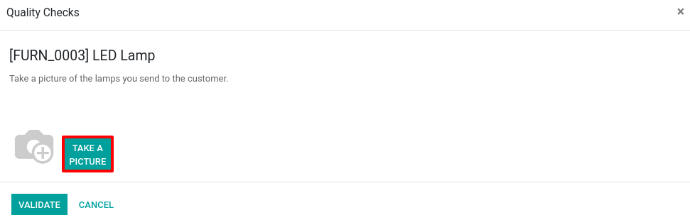

Pass-Fail
---------

This type of control point requires that you specify if the products
pass or fail a specific text. It can be applied for both transfers or
manufacturing orders.

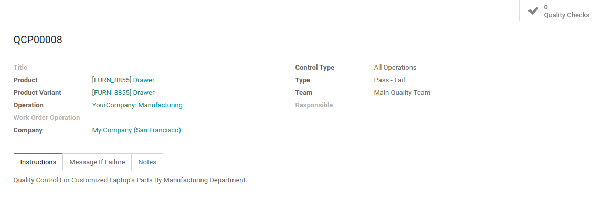

For this kind of control point type, you have the possibility to define
a failure message that will give instructions to follow in case of
quality check failure.

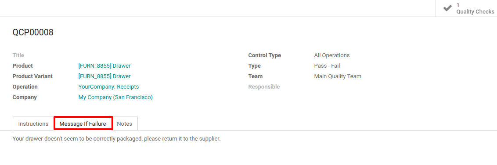

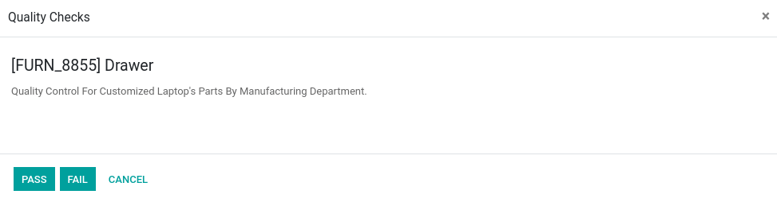

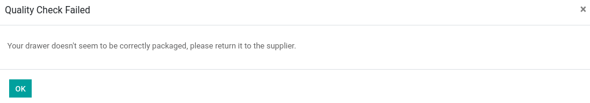

Take a Measure
--------------

This control point type requires you to enter the product’s measurements
during a transfer, or during the manufacturing process.

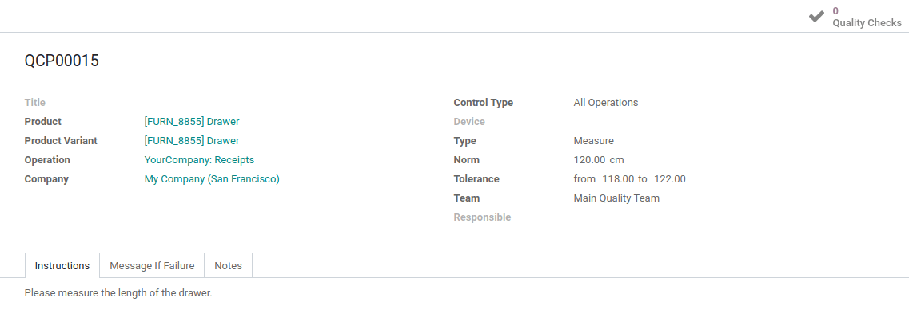

For this kind of control point type, you also have the possibility to
define a failure message that will give instructions to the worker.

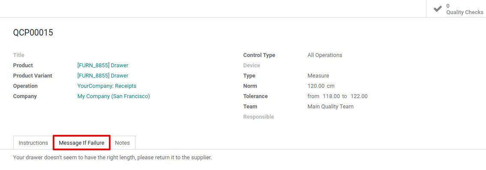

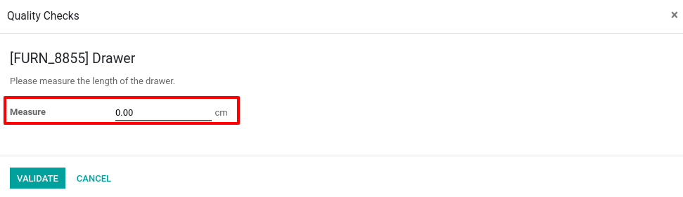

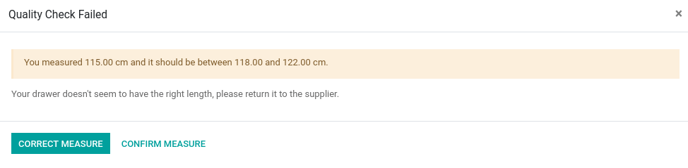

Register Consumed Materials
---------------------------

This control point type requires you register the component serial/lot
numbers during the manufacturing process. It is only available if you
work with routings.

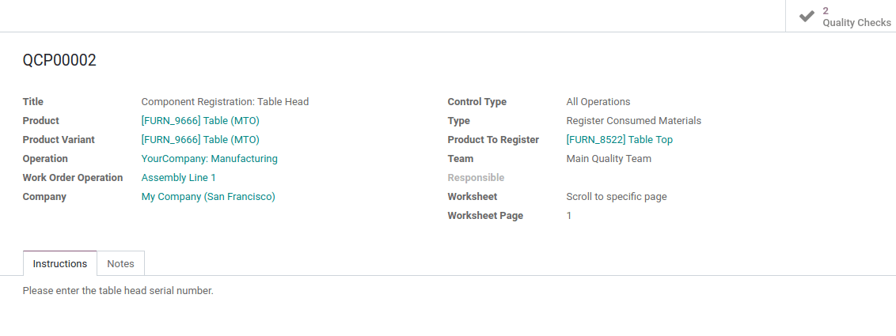

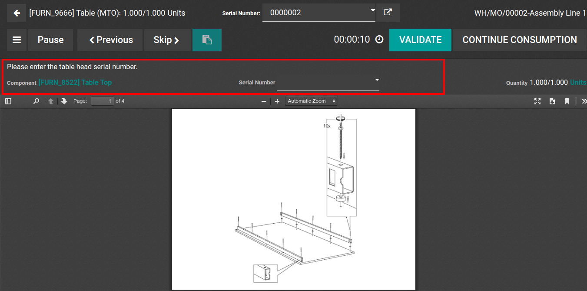

Register By-Products
--------------------

With this control point type, you must register the serial/lot number of
the by-products that are manufactured. It is also only available with
routings.

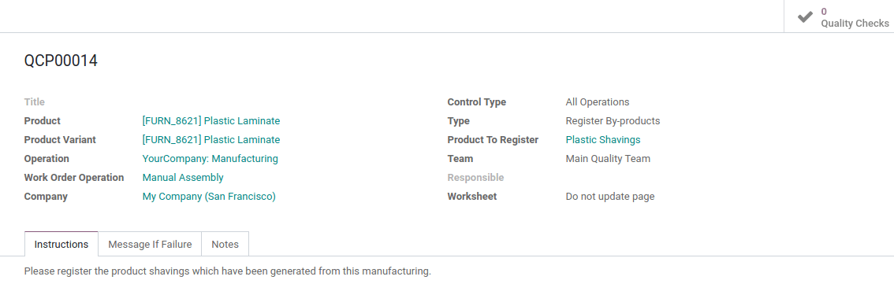

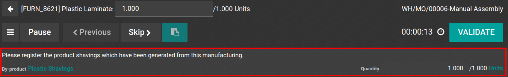

Print Label
-----------

This control point type allows you to print labels to add to the product
during the manufacturing process.

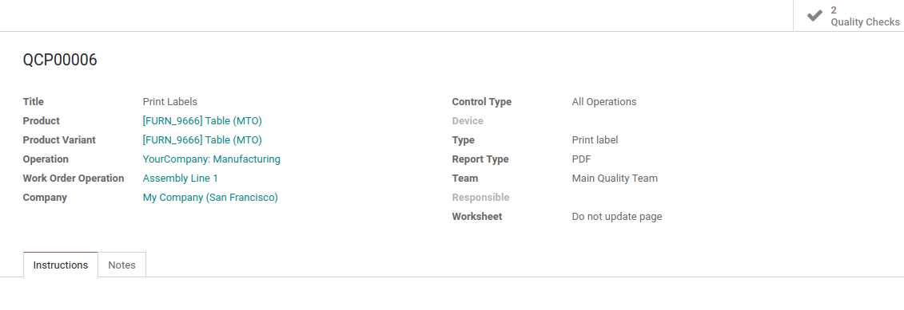

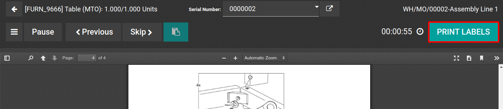