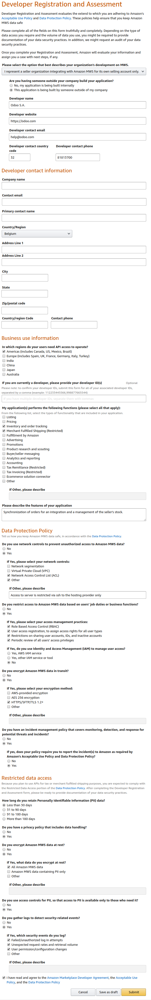

================================
Apply for Amazon MWS Access Keys
================================

.. _amazon/developer-form:

Submit the Amazon MWS Developer Registration and Assessment Form
================================================================

In order to synchronize your Amazon orders with Odoo, Amazon MWS access keys are required.
They can be obtained by submitting the **Amazon MWS Developer Registration and Assessment form** to
register as a developer. Once recognized by Amazon as a developer (i.e. you make use of an
application connecting to MWS), you will be granted Amazon MWS access keys.

First, visit the `Amazon Marketplace Web Service documentation
<http://docs.developer.amazonservices.com/en_US/dev_guide/DG_Registering.html>`_ and follow the
instructions to register as a developer. Take care to choose the form "I represent a seller
organization integrating with Amazon MWS for its own selling account only.".

Fill out the *Developer Registration and Assessment form* as suggested below and provide your own
contact information in the **Developer contact information** section. In the **Business use
information** section, select the correct region of your seller account. For the other sections,
adapt your responses in accordance with your business case.

Give a particular attention to **Merchant Fulfilled Shipping**. It should only be checked if you
ship your products yourself. You should uncheck it if you sell exclusively with the *Fulfillment by
Amazon* service. Please note that requesting this function is not recommended if you are hosted on
*Odoo Online* or *Odoo.sh* as the additional security requirements asked by Amazon may not be met by
Odoo.

.. warning::
   Depending on several factors (your region, whether you checked the **Merchant Fulfilled
   Shipping** function (i.e. you request access to Personally Identifiable Information of your
   customers), etc.), Amazon may request you to fill out a second form before granting you MWS
   access keys. As that form depends on the data protection policy of the region of your seller
   account (e.g. GDPR in Europe), we cannot provide you with a pre-filled form. Instead, the answers
   of questions related to Odoo are listed in the `Answer the Additional Form`_ section.

.. tip::
   If you need assistance for your application for Amazon MWS access keys, `submit a support ticket
   to Odoo <https://www.odoo.com/help>`_.

Answer the Additional Form
==========================

.. tip::
   If you did not receive any additional form after your :ref:`initial application for Amazon MWS
   keys <amazon/developer-form>`, you may disregard this section.

This section lists all questions asked by Amazon in additional forms. The answers are tailored for
*Odoo Online* and *Odoo.sh*. Wherever the answer does not depend on Odoo, you are requested to
provide it yourself at the place indicated by square brackets.

.. warning::
   If you are *not* hosted on Odoo.com (*online*) or on Odoo.sh, you should adapt the answers
   related to hosting according to your own infrastructure and data protection policy.

- **Describe all functionalities in your application where Personally Identifiable Information (e.g.
  customer name, street address, billing address) is required.**

  ► If you did not apply for the *Merchant Fulfilled Shipping* function:
    | - Generation of customer invoices

  ► If you applied for the *Merchant Fulfilled Shipping* function:
    | - Generation of delivery orders
    | - Generation of customer invoices

- **List all outside parties with whom your organization shares Amazon Information (e.g. information
  exposed by Amazon through Amazon MWS, Seller Central, or Amazon's public-facing websites) and
  describe how your organization shares this information.**

  We share Amazon Information with Odoo SA, our cloud service provider, for the exclusive purpose of
  hosting our enterprise management system (including the Amazon MWS integration). See also
  Odoo SA's Privacy Policy for details at `odoo.com/privacy <https://www.odoo.com/privacy>`_.

  ► If you share Amazon Information with outside parties:
    [Answer with the above text and add a description of your organization's policy regarding the
    sharing of Amazon Information with outside parties]

- **List all non-Amazon MWS sources where you retrieve Amazon Information.**

  Our enterprise software only relies on MWS to retrieve Amazon Information.

- **Describe how your organization restricts public access to databases, file servers, and
  desktop/developer endpoints.**

  We rely on Odoo S.A., our cloud service provider for our database security management. Their
  Security Policy can be found at `odoo.com/security <https://www.odoo.com/security>`_.

- **Describe how your organization uniquely identifies employees and restricts access to Amazon
  Information on a need-to-know basis.**

  ► If all your employees are properly assigned separate users and given only relevant access rights:
    Access rights are provided to employees based on their role within the company and are
    progressive, based on their responsibility.

    For instance, salespersons only have access to their own leads/quotes (and thus no access to
    quotes generated through the Amazon API). A salesmanager has access to all quotes/leads for
    reporting purposes (including quotes generated through the Amazon API). A quote will generate a
    delivery order which will be accessible to a 'normal' user of the Inventory application for him
    to be able to print the delivery label and pack the products.

  ► If your employees share users or if they are given more rights than needed:
    [Answer with a description of your organization's policy for the assignation of users and access
    rights to your employees]

- **Describe how your organization prevents Amazon Information from being accessed from employee
  personal devices.**

  Our enterprise software does not prevent employees from accessing the organization's data from
  personal devices. Role-based restrictions and access rights still apply.

- **Provide details on your organization's privacy and data handling policies (a link to your policy
  is also acceptable).**

  [Answer with a description of your organization's privacy and data handling policies]

- **Describe where your organization stores Amazon Information and provide details on how you
  encrypt this information (e.g., algorithm).**

  We rely on Odoo S.A., our cloud service provider for our database security management. Their
  Security Policy can be found at `odoo.com/security <https://www.odoo.com/security>`_.

- **Describe how your organization backups or archives Amazon Information and provide details on how
  you encrypt this information (e.g., algorithm).**

  We rely on Odoo S.A., our cloud service provider for our database backups management. Their
  Service Level Agreement can be found at `odoo.com/cloud-sla <https://www.odoo.com/cloud-sla>`_.

- **Describe where your organization monitors and detects malicious activity in your
  application(s).**

  We rely on Odoo S.A., our cloud service provider for our database security management. Their
  Security Policy can be found at `odoo.com/security <https://www.odoo.com/security>`_.

- **Describe how your organization's incident response plan addresses database hacks, unauthorized
  access, and data leaks (a link to your policy is also acceptable).**

  Our cloud service provider, Odoo S.A., will notify the customer in case of a data breach.

  [Add a description of your organization's incident response plan or a link to your incident
  response policy.]
