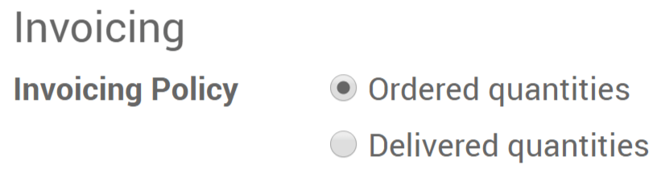

================================================
Invoice based on delivered or ordered quantities
================================================

Depending on your business and what you sell, you have two options for
invoicing:

- Invoice on ordered quantity: invoice the full order as soon as the sales
  order is confirmed.
- Invoice on delivered quantity: invoice on what you delivered even if
  it's a partial delivery.

Invoice on ordered quantity is the default mode.

The benefits of using *Invoice on delivered quantity* depends on your
type of business, when you sell material, liquids or food in large
quantities the quantity might diverge a little bit and it is therefore
better to invoice the actual delivered quantity.

.. note::
    You also have the ability to invoice manually, letting you
    control every options: invoice ready to invoice lines, invoice a
    percentage (advance), invoice a fixed advance.

Decide the policy on a product page
===================================

From any products page, under the invoicing tab you will find the
invoicing policy and select the one you want.

Send the invoice
================

Once you confirm the sale, you can see your delivered and invoiced
quantities.

.. image:: media/invoicing_policy02.png
    :align: center

If you set it in ordered quantities, you can invoice as soon as the sale
is confirmed. If however you selected delivered quantities, you will
first have to validate the delivery.

Once the products are delivered, you can invoice your customer. Odoo
will automatically add the quantities to invoiced based on how many you
delivered if you did a partial delivery.
