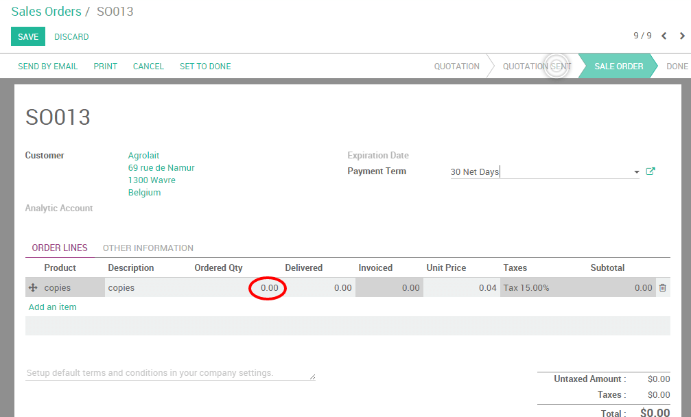

=============================================
How to re-invoice expenses to your customers?
=============================================

It often happens that your employees have to spend their personal money
while working on a project for your client. Let's take the example of an
employee paying a parking spot for a meeting with your client. As a
company, you would like to be able to invoice that expense to your
client.

In this documentation we will see two use cases. The first, very basic,
consists of invoicing a simple expense to your client like you would do
for a product. The second, more advanced, will consist of invoicing
expenses entered in your expense system by your employees directly to
your customer.

Use case 1: Simple expense invoicing
====================================

Let's take the following example. You are working on a promotion
campaign for one of your customers (``Agrolait``) and you have to print a
lot of copies. Those copies are an expense for your company and you
would like to invoice them.

Configuration
-------------

In order to sell services and to send invoices, you need to install the
**Sales** application, from the **Apps** icon.

.. image:: media/reinvoice01.png
    :align: center

Create product to be expensed
-----------------------------

You will need now to create a product called ``Copies``.

From your **Sales** module, go to :menuselection:`Sales --> Products` 
and create a product as follows:

-   **Product type**: consumable

-   **Invoicing policy**: on delivered quantities (you will manually
    set the quantities to invoice on the sale order)

Create a sale order
-------------------

Now that your product is correctly set up, you can create a sale order
for that product (from the menu :menuselection:`Sales --> Sales Orders`) 
with the ordered quantities set to 0. 
Click on **Confirm the Sale** to create the sale
order. You will be able then to manually change the delivered quantities
on the sale order to reinvoice the copies to your customer.

Invoice expense to your client
------------------------------

At the end of the month, you have printed ``1000`` copies on behalf of your
client and you want to re-invoice them. From the related sale order,
click on **Delivered Quantities**, manually enter the correct amount of
copies and click on **Save**. Your order line will turn blue, meaning that
it is ready to be invoiced. Click on **Create invoice**.

.. note::
    The total amount on your sale order will be of 0 as it is computed on 
    the ordered quantities. It is your invoice which will compute the 
    correct amount due by your customer.

The invoice generated is in draft, so you can always control the
quantities and change the amount if needed. You will notice that the
amount to be invoiced is based here on the delivered quantities.

.. image:: media/reinvoice04.png
    :align: center

Click on validate to issue the payment to your customer.

Use case 2: Invoice expenses via the expense module
===================================================

To illustrate this case, let's imagine that your company sells some
consultancy service to your customer ``Agrolait`` and both parties agreed
that the distance covered by your consultant will be re-invoiced at
cost.

Configuration
-------------

Here, you will need to install two more modules:

-   Expense Tracker

-   Accounting, where you will need to activate the analytic accounting
    from the settings

.. image:: media/reinvoice05.png
    :align: center

Create a product to be expensed
-------------------------------

You will now need to create a product called ``Kilometers``.

From your **Sales** module, go to :menuselection:`Sales --> Products` 
and create a product as follows:

-   Product can be expensed

-   Product type: Service

-   Invoicing policy: invoice based on time and material

-   Expense invoicing policy: At cost

-   Track service: manually set quantities on order

.. image:: media/reinvoice06.png
    :align: center

Create a sales order
--------------------

Still from the Sales module, go to :menuselection:`Sales --> Sales Orders` 
and add your product **Consultancy** on the order line.

.. tip::
    If your product doesn't exist yet, you can configure it on the fly 
    from the SO. Just type the name on the **product** field and click 
    on **Create and edit** to configure it.

Depending on your product configuration, an **Analytic Account** may have
been generated automatically. If not, you can easily create one in order
to link your expenses to the sale order. Do not forget to confirm the
sale order.

.. note::
    Refer to the documentation :doc:`../../../accounting/others/analytic/usage` 
    to learn more about that concept.

Create expense and link it to SO
--------------------------------

Let's assume that your consultant covered ``1.000km`` in October as part
of his consultancy project. We will create a expense for it and link
it to the related sales order thanks to the analytic account.

Go to the **Expenses** module and click on **Create**. Record your expense
as follows:

-   **Expense description**: Kilometers October 2015

-   **Product**: Kilometers

-   **Quantity**: 1.000

-   **Analytic account**: SO0019 - Agrolait

.. image:: media/reinvoice08.png
    :align: center

Click on **Submit to manager**. As soon as the expense has been validated
and posted to the journal entries, a new line corresponding to the
expense will automatically be generated on the sale order.

Invoice expense to your client
------------------------------

You can now invoice the invoiceable lines to your customer.

.. image:: media/reinvoice09.png
    :align: center

.. seealso::
    * :doc:`support`
    * :doc:`time_materials`
    * :doc:`milestones`
    * :doc:`../products/delivery`