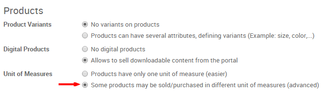

==================================================
How to invoice a support contract (prepaid hours)?
==================================================

There are different kinds of service sales: prepaid volume of hours/days
(e.g. support contract), billing based on time and material (e.g.
billing consulting hours) and a fixed price contract (e.g. a project).

In this section, we will have a look at how to sell and keep track of a
pre-paid support contract.

As an example, you may sell a pack of ``50 Hours`` of support at ``$25,000``.
The price is fixed and charged initially. But you want to keep track of
the support service you did for the customer.

Configuration
=============

Install the Sales and Timesheet applications
--------------------------------------------

In order to sell services, you need to install the **Sales** application,
from the **Apps** icon. Install also the **Timesheets** application if you want
to track support services you worked on every contract.

.. image:: media/support01.png
    :align: center

Create Products
---------------

By default, products are sold by number of units. In order to sell
services ``per hour``, you must allow using multiple unit of measures.
From the **Sales** application, go to the menu 
:menuselection:`Configuration --> Settings`.
From this screen, activate the multiple **Unit of Measures** option.

In order to sell a support contract, you must create a product for every
support contract you sell. From the **Sales** application, use the menu
:menuselection:`Sales --> Products`, create a new product with the following setup:

-   **Name**: Technical Support

-   **Product Type**: Service

-   **Unit of Measure**: Hours

-   **Invoicing Policy**: Ordered Quantities, since the service is
    prepaid, we will invoice the service based on what has been
    ordered, not based on delivered quantities.

-   **Track Service**: Timesheet on contracts. An analytic account will
    automatically be created for every order containing this service
    so that you can track hours in the related account.

.. image:: media/support04.png
    :align: center

.. tip:: 
    There are different ways to track the service related to a sale 
    order or product sold. With the above configuration, you can only 
    sell one support contract per order. If your customer orders 
    several service contracts on timesheet, you will have to split 
    the quotation into several orders.

Note that you can sell in different unit of measure than hours, example:
days, pack of 40h, etc. To do that, just create a new unit of measure in
the **Unit of Measure** category and set a conversion ratio compared to
**Hours** (example: ``1 day = 8 hours``).

Managing support contract
=========================

Quotations and Sale Orders
--------------------------

Once the product is created, you can create a quotation or a sale order
with the related product. Once the quotation is confirmed and
transformed into a sale order, your users will be able to record
services related to this support contract using the timesheet
application.

.. image:: media/support05.png
    :align: center

Timesheets
----------

To track the service you do on a specific contract, you should use the
timesheet application. An analytic account related to the sale order has
been automatically created (``SO009 - Agrolait`` on the screenshot here
above), so you can start tracking services as soon as it has been sold.

.. image:: media/support06.png
    :align: center

Control delivered support on the sale order
-------------------------------------------

From the **Sales** application, use the menu 
:menuselection:`Sales --> Sales Orders`  to control
the progress of every order. On the sales order line related to the
support contract, you should see the **Delivered Quantities** that are
updated automatically, based on the number of hours in the timesheet.

.. image:: media/support07.png
    :align: center

Upselling and renewal
---------------------

If the number of hours you performed on the support contract is bigger
or equal to the number of hours the customer purchased, the sale order
**Invoicing Status** is automatically set to **Upselling**. This means you
have an opportunity to sell an extra contract to the customer since he
used all his quota of service.

Periodically (ideally once every two weeks), you should check the sales
order that are in an upselling status. To do this, go to the 
:menuselection:`Sales --> Sales Order` menu and use the **Upselling** 
filter to get all orders that are in upselling.

.. tip::
    If you use Odoo CRM, a good practice is to create an opportunity for 
    every sale order in upselling invoice status so that you easily track 
    your upselling effort.

If you sell an extra support contract, you can either add a new line on
the existing sale order (thus, you continue to timesheet on the same
order) or create a new order (thus, people will timesheet their hours on
the new contract). To unmark the sale order as **Upselling**, you can set
the sale order as done and it will disappear from your upselling list.

Special Configuration
=====================

When creating the product form, you may set a different approach to
track the service:

-   **Create task and track hours**: in this mode, a task is created for
    every sale order line. Then when you do the timesheet, you don't
    record hours on a sale order/contract, but you record hours on a
    task (that represents the contract). The advantage of this
    solution is that it allows to sell several service contracts
    within the same sale order.

-   **Manually**: you can use this mode if you don't record timesheets in
    Odoo. The number of hours you worked on a specific contract can
    be recorded manually on the sale order line directly, in the
    delivered quantity field.

.. seealso::
    * :doc:`time_materials`
    * :doc:`../../../inventory/settings/products/uom`
